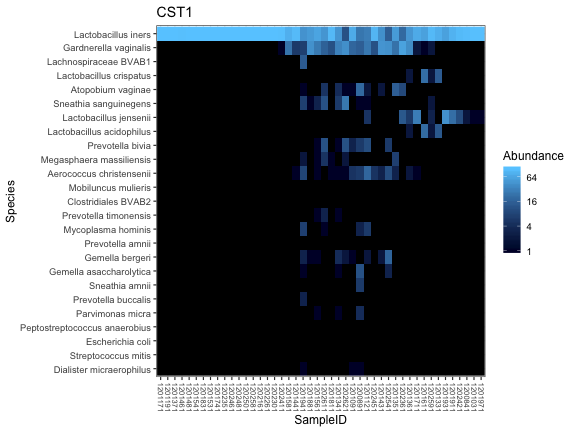
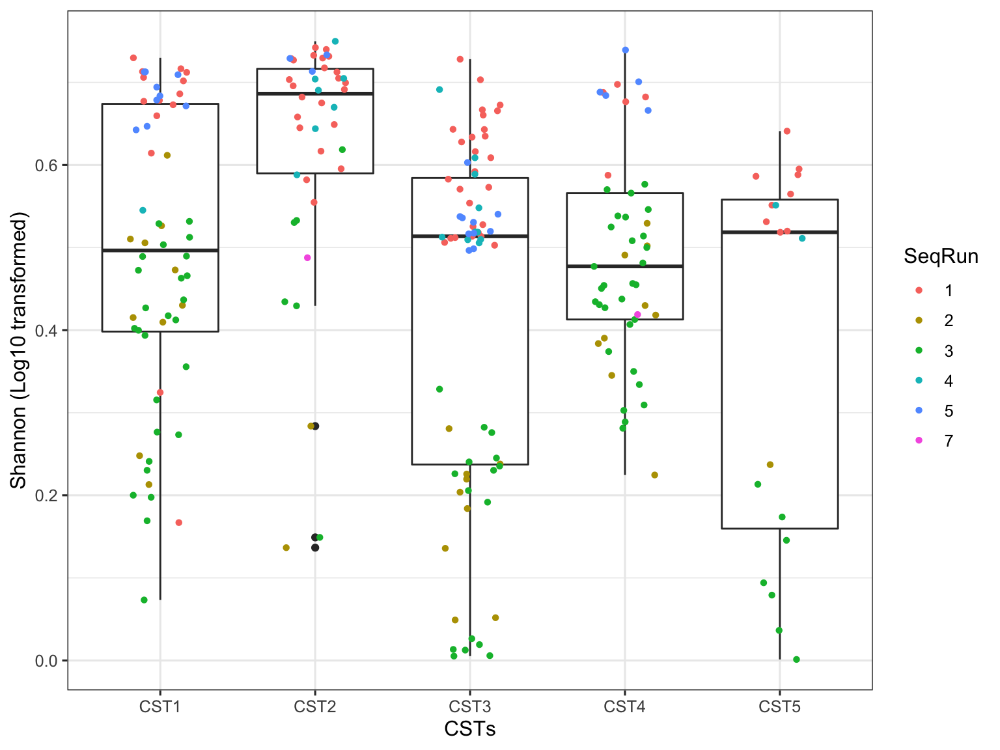
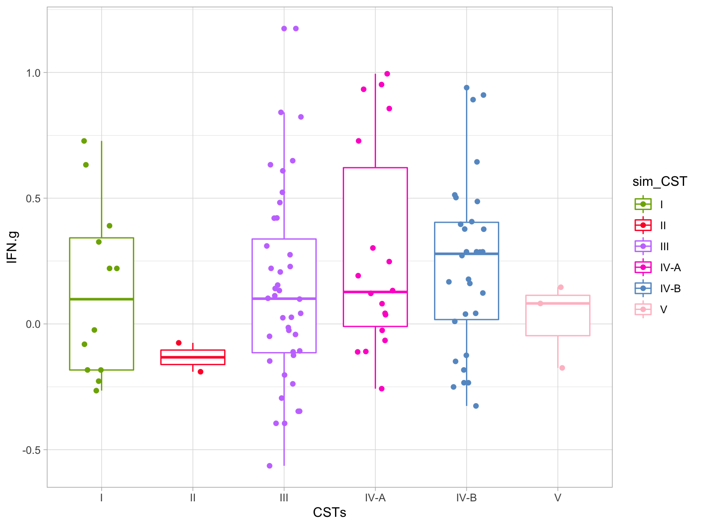
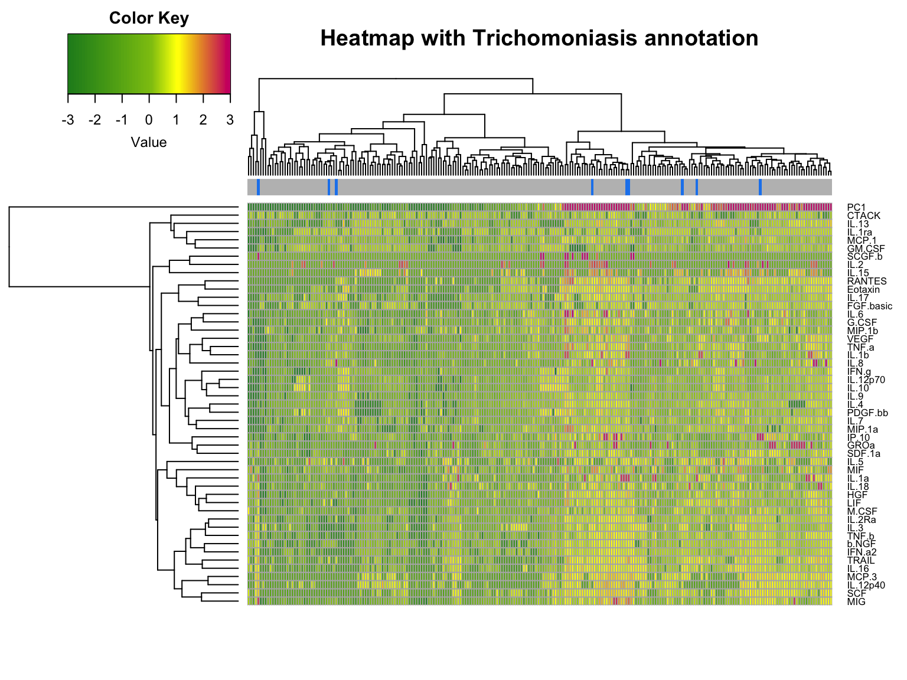

# Introduction
The goals of this analysis are to;  
a) Characterise the genital microbiome in women,   
b) Assess the impact of STIs and vaginal disybiosis on the on this microbiome  
c) Assess the impact of STI treatment on subsequent visits on the microbiome  
d) To a lesser extent assess the correlation of CSTs with pro-inflammatory cytokines  

To answer these questions, data accross three time points was collected from upto 244 HIV negative women. All women who presented with BV and/or STIs at visit1 were treated with antibiotics and sheduled for a second and third review visit. At the visits, pro-inflammatory cytokines were extracted using soft-cup and bacterial DNA using a vaginal swab.

## Part A: Characterisation of female genital tract microbiome
What is the distribution of bacteria in these women? is there any form of clustering?

## Key results
* 4 major CSTs identified, with a dominance of Lactobacillus inners among the health women and Gardinarrela vaginalis among the BV affected women.  
* The four CSTs are broken down as below;  
  CT1 - Crispatus  
  CT2 - Inners  
  CT3 - Multiple species (no single dominant species)  
  CT4 - Gardarnela (also dominated by BV)  
* Significantly associated with BV and STIs especially gonorrhea.  


```r
## CSTs custom color color pallete
CSTsPallete <- c("#7CAE00", "#00BFC4", "#C77CFF",  "#F8766D")
visitsPallet <- c("lightskyblue4", "red", "lightskyblue")
proInfC <- c("TNF.b"  , "IL.12p40" , "IL.12p70" , "IL.1a" , "IL.6" , "TNF.a" , "IL.1b", "IL.18" , "MIF" , "TRAIL")
allCytokineColnames <- c("b.NGF","CTACK","Eotaxin","FGF.basic","G.CSF","GM.CSF", "GROa", "HGF","IFN.a2", "IFN.g","IL.10","IL.12p70","IL.12p40","IL.13","IL.15","IL.16","IL.17","IL.18","IL.1a","IL.1b", "IL.1ra", "IL.2", "IL.2Ra", "IL.3", "IL.4", "IL.5", "IL.6", "IL.7", "IL.8", "IL.9","IP.10","LIF","M.CSF","MCP.1","MCP.3","MIF","MIG","MIP.1a", "MIP.1b", "PDGF.bb","RANTES", "SCF","SCGF.b", "SDF.1a", "TNF.a","TNF.b","TRAIL","VEGF")
## 
```

# Read in and preprocess data

Read in data, prepare for analysis and perform sanity checks


prepare for analysis and perform sanity checks


# Data Cleaning and Preprocessing

## Filter out taxa without Phylum

Taxa without assignment at the Phylumn level are likely spurious and will not be relevant in the downstream analyses so dropping those. In this case we filter out the 'NA's and ""s.


## Filter out non-bacterial taxa

Sample preparation and handling can introduce contamination (non-bacterial DNA). We need to check for and remove all this DNA from the remaining samples.


## Data summary and assessment

With our data now clean, we can perform an evaluation of what remains;

1) Evaluate Amplicon Sequence Variants (ASV) summary statistics
2) Detect and remove outlier samples
3) Prevalence estimation and filtering

*Step 1: Evaluate Amplicon Sequence Variants (ASV) summary statistics*
ASV summary plots.


View number of sequences per taxa (left plot). Highest value is over 100000, but this just for one taxa. Number reduce as the number of taxa increase. On the right, number of 

*Step 2: Detect and remove outliers*

When questionable samples arise you should take note of them so if there are samples which behave oddly in downstream analysis you can recall this information and perhaps justify their removal. 


## Create or reorder factors

Create factor variables for downstream analyses

Perform prevalence filtering in final dataset


## load 

```r
load(paste0(getwd(), "/processed/psn.RData"))

ps0.phylum.bact <- psn
tax_table(ps0.phylum.bact)[, "Species"] <- ifelse(!is.na(tax_table(ps0.phylum.bact)[, "Species"]), paste(tax_table(ps0.phylum.bact)[, "Genus"], tax_table(ps0.phylum.bact)[, "Species"]), "")
```


## Rarefaction plots to evaluate depth of sequencing 

Are most samples sequenced to saturation?


```r
 ## Read counts per sample 
 #sample.data <- data.table(as(sample_data(ps0.phylum.bact), "data.frame"), TotalReads = sample_sums(ps0.phylum.bact)) 
 #sample.data$SampleNo <- seq_along(1:nrow(sample.data))

 ## Save read counts to excel 
 #writexl::write_xlsx(sample.data[, c("SeqName", "TotalReads")], "results/data/ReadCountsPerSampleR2.xlsx") 

 ## Rarefaction curve 
  #ps2 <- prune_samples(sample_sums(ps0.phylum.bact) > 0, ps0.phylum.bact) ##Drop samples with 0 reads, 
  #ggrare(ps2, color = "bvscat", label = "SampleNo", se = FALSE) +  
   #facet_wrap(~VisitCode) + 
   #ggtitle("Rarefaction of Curve Showing Saturation of ASVs") 
```


# Visit 1 analyses

Before, the third step (prevalence assessment and filtering), we will subset the data from visit 1 to proceed with so that we can see prevalence in just visit 1.


### Subset visit 1 data


```r
#Subset out visit 1 data only.
ps1 <- subset_samples(ps0.phylum.bact, VisitCode == 1000)
#Remove taxa not associated with any samples anymore
ps1 <- prune_taxa(taxa_sums(ps1) > 0, ps1)
ps1
```

```
## phyloseq-class experiment-level object
## otu_table()   OTU Table:         [ 398 taxa and 242 samples ]
## sample_data() Sample Data:       [ 242 samples by 75 sample variables ]
## tax_table()   Taxonomy Table:    [ 398 taxa by 7 taxonomic ranks ]
## phy_tree()    Phylogenetic Tree: [ 398 tips and 397 internal nodes ]
```

```r
## Sequencing depth summary
dt.ps1.sample_data = data.table(as(sample_data(ps1), "data.frame"),
                          TotalReads = sample_sums(ps1), keep.rownames = TRUE) ##Total reads is sequence depth
setnames(dt.ps1.sample_data, "rn", "SampleID") #Only creates a duplicate first column Sample ID so commented out.
dt.ps1.sample_data <- dt.ps1.sample_data[, -1] #Drop the first column as is a duplicate of sample ID
#View(dt.ps0.sample_data)

gg.SeqDepth = ggplot(dt.ps1.sample_data, aes(TotalReads)) + geom_histogram() + ggtitle("Sequencing Depth")
ggplotly(gg.SeqDepth)
```


The graph shows how many reads each sample has. The Y-axis shows the number samples and the X-axis shows the total number of reads for those samples, in total 242 samples remaining for visit 1.

## Create visit specific variables Reorder and rename Factors

Visit one specific factors and variables

```r
#Create categorical variable for age, bining in 5 year intervals
summary(sample_data(ps1)$Age) #What is the age distribution within the dataset
```

```
##    Min. 1st Qu.  Median    Mean 3rd Qu.    Max. 
##   18.00   21.00   23.00   24.17   27.00   40.00
```

```r
sample_data(ps1)$agecat[sample_data(ps1)$Age <= 23] <- "gp18" 
sample_data(ps1)$agecat[sample_data(ps1)$Age > 23 & sample_data(ps1)$Age <= 28] <- "gp23"
sample_data(ps1)$agecat[sample_data(ps1)$Age > 28 & sample_data(ps1)$Age <= 33] <- "gp28"
sample_data(ps1)$agecat[sample_data(ps1)$Age > 33 & sample_data(ps1)$Age <= 38] <- "gp33"
sample_data(ps1)$agecat[sample_data(ps1)$Age > 38] <- "gp38"
sample_data(ps1)$agecate <- as.factor(sample_data(ps1)$agecat) #Convert age categories to factor


cat("Check distribution of samples accross factors\n\nSample distribution by Inflammation")
```

```
## Check distribution of samples accross factors
## 
## Sample distribution by Inflammation
```

```r
table(sample_data(ps1)$Inflammation)
```

```
## 
##   0   1 
## 192  50
```

```r
cat("Sample distribution by BV category")
```

```
## Sample distribution by BV category
```

```r
table(sample_data(ps1)$bvscat)
```

```
## 
##     Negative Intermediate           BV 
##           74           85           83
```

```r
cat("Sample distribution by age category")
```

```
## Sample distribution by age category
```

```r
table(sample_data(ps1)$agecat)
```

```
## 
## gp18 gp23 gp28 gp33 gp38 
##  130   74   24   11    3
```
 
It does not appear that BV has any relationship with inflammation and we can confirm so from the statistical test.


```r
cat("Cross tabulation: BV vs Inflammation")
```

```
## Cross tabulation: BV vs Inflammation
```

```r
bv_infl <- data.frame(cbind(BV = sample_data(ps1)$bvscat, Inflammation = sample_data(ps1)$Inflammation))
bv_infl <- apply_labels(bv_infl,
                        BV = "BV Status",
                        Inflammation = "Inflammation")
cro(bv_infl$BV, bv_infl$Inflammation)
```

<table class='gmisc_table' style='border-collapse: collapse; margin-top: 1em; margin-bottom: 1em;' >
<thead>
<tr>
<th style='border-top: 2px solid grey;'></th>
<th colspan='2' style='font-weight: 900; border-bottom: 1px solid grey; border-top: 2px solid grey; text-align: center;'>&nbsp;Inflammation&nbsp;</th>
</tr>
<tr>
<th style='font-weight: 900; border-bottom: 1px solid grey; text-align: center;'></th>
<th style='border-bottom: 1px solid grey; text-align: center;'>&nbsp;1&nbsp;</th>
<th style='border-bottom: 1px solid grey; text-align: center;'>&nbsp;2&nbsp;</th>
</tr>
</thead>
<tbody> 
<tr><td colspan='3' style='font-weight: 900;'>&nbsp;BV Status&nbsp;</td></tr>
<tr>
<td style='text-align: left;'>&nbsp;&nbsp;&nbsp;1&nbsp;</td>
<td style='text-align: right;'>62</td>
<td style='text-align: right;'>12</td>
</tr>
<tr>
<td style='text-align: left;'>&nbsp;&nbsp;&nbsp;2&nbsp;</td>
<td style='text-align: right;'>63</td>
<td style='text-align: right;'>22</td>
</tr>
<tr>
<td style='text-align: left;'>&nbsp;&nbsp;&nbsp;3&nbsp;</td>
<td style='text-align: right;'>67</td>
<td style='text-align: right;'>16</td>
</tr>
<tr>
<td style='border-bottom: 2px solid grey; text-align: left;'>&nbsp;&nbsp;&nbsp;#Total cases&nbsp;</td>
<td style='border-bottom: 2px solid grey; text-align: right;'>192</td>
<td style='border-bottom: 2px solid grey; text-align: right;'>50</td>
</tr>
</tbody>
</table>

```r
cat("fishers test to see if there is any form of association")
```

```
## fishers test to see if there is any form of association
```

```r
fisher.test(sample_data(ps1)$bvscat, sample_data(ps1)$Inflammation)
```

```
## 
## 	Fisher's Exact Test for Count Data
## 
## data:  sample_data(ps1)$bvscat and sample_data(ps1)$Inflammation
## p-value = 0.3198
## alternative hypothesis: two.sided
```

*Step 3: Prevalance assessment*

Plot Phyla present along with information about their prevalence (i.e. fraction of samples they are present in) and total abundance accross samples. Dashed horizontal line to show the 5% margin at which we intend to filter.


```
## Maximum prevalence:  118
```

```
## Minimum prevalence:  2
```


Based on the plots above, we will remove low abundance taxa i.e taxa that is under represented at Phylum level then we will filter by minimum prevalence threshold of 0.05


```r
# Remove specific taxa 
get_taxa_unique(ps1, "Phylum")
```

```
## [1] "Firmicutes"     "Actinobacteria" "Fusobacteria"   "Bacteroidetes" 
## [5] "Proteobacteria" "Tenericutes"
```

```r
# Define a list with taxa to remove. Acidobacteria does not really occur humans so we will drop
filterPhyla = c( "[Thermi]", "Chloroflexi", "Synergistetes", "Verrucomicrobia", "Spirochaetes", "Nitrospirae", "SR1", "TM7")
#filterSpecies <- c("Peptoniphilus harei")
filterPhyla
```

```
## [1] "[Thermi]"        "Chloroflexi"     "Synergistetes"   "Verrucomicrobia"
## [5] "Spirochaetes"    "Nitrospirae"     "SR1"             "TM7"
```

```r
#ps1.prevalence <- subset_taxa(ps1, !(Phylum %in% filterPhyla | Species %in% filterSpecies))
#ps1.prevalence <- subset_taxa(ps1, !(Phylum %in% filterPhyla))
#get_taxa_unique(ps1.prevalence, "Phylum")

# Removing taxa that fall below 5% prevelance
# Define the prevalence threshold
#prevalenceThreshold = 0.05 * nsamples(ps1.prevalence)
#prevalenceThreshold

# Define which taxa fall within the prevalence threshold
#keepTaxa <- rownames(df.ps1.prevalence.phylum)[(df.ps1.prevalence.phylum$Prevalence >= prevalenceThreshold)]
#ntaxa(ps1)
# Remove those taxa

#ps1.prevalence <- prune_taxa(keepTaxa, ps1.prevalence)
ps1.prevalence <- ps1
ntaxa(ps1.prevalence)
```

```
## [1] 398
```

## Community State Types 

Community state types are infered from model based clustering using Mclust. The scree plot is used to determine how many unique groupings are represented in the data to inform the maximum number of CSTs to keep.

```
## fitting ...
## 
  |                                                                       
  |                                                                 |   0%
  |                                                                       
  |=========                                                        |  14%
  |                                                                       
  |===================                                              |  29%
  |                                                                       
  |============================                                     |  43%
  |                                                                       
  |=====================================                            |  57%
  |                                                                       
  |==============================================                   |  71%
  |                                                                       
  |========================================================         |  86%
  |                                                                       
  |=================================================================| 100%
```


```
## ---------------------------------------------------- 
## Gaussian finite mixture model fitted by EM algorithm 
## ---------------------------------------------------- 
## 
## Mclust VVI (diagonal, varying volume and shape) model with 4 components: 
## 
##  log-likelihood   n   df       BIC       ICL
##       -46427.31 242 1939 -103497.7 -103497.7
## 
## Clustering table:
##   1   2   3   4 
##  60 109  20  53
```

```
## [1] "VVI"
```

```
## [1] 4
```

```
## [1] "CST1" "CST2" "CST3" "CST4"
```

```
## [1] "CST1" "CST2" "CST3" "CST4"
```


```
##  [1] 20.9875289 11.6844745  9.7773414  7.8359635  5.3138353  4.0485564
##  [7]  3.1722514  2.7427717  2.3428252  2.1206466  1.9290086  1.7301425
## [13]  1.6423635  1.3940450  1.1821225  1.1677944  1.1173569  0.8480507
## [19]  0.7524435  0.7224261
```

```
## [1] -0.3244071 -0.3328268 -0.3683910 -0.3911561 -0.5941687 -0.8395651
```


```
## Clustering k = 1,2,..., K.max (= 12): .. done
## Bootstrapping, b = 1,2,..., B (= 50)  [one "." per sample]:
## .................................................. 50
```


## Heatmaps

### Using Mclust clusters
Individual cluster heatmaps showing distribution within a single CST.

```r
CSTs <- as.character(cstLabels)
taxa.order <- names(sort(taxa_sums(ps1.cst.glom.Species.ra)))
for(CST in CSTs) {
  ps1.cst.glom.Species.ra.top25 <- prune_taxa(names(sort(taxa_sums(ps1.cst.glom.Species.ra), T))[1:25], ps1.cst.glom.Species.ra)
  ps1.cst.glom.Species.ra.top25 <- prune_samples(sample_data(ps1.cst.glom.Species.ra.top25)$classif2 == CST,     ps1.cst.glom.Species.ra.top25)
  print(plot_heatmap(ps1.cst.glom.Species.ra.top25, taxa.label="Species", sample.label = "SampleID", taxa.order=taxa.order) + ggtitle(paste(CST)))
}
```



### Combined Heatmap

Combined heatmap showing all the samples ordered by CSTs and Shannon diversity.   

PS: Legends for the annotations will be imposed in the final graphics using a different program. However, for BV, No BV=white, intermediate=grey and bv positive=maroon. Ids followed up in sebsequent visits are indicated with a grey stripe in the 'Followed id' annotation.  


```
## Distribution of BV accross CSTs
```

```
##       
##        Negative Intermediate BV
##   CST1        9           38 62
##   CST2       19           19 15
##   CST3       30           24  6
##   CST4       16            4  0
```


## Plot Ordinations and Diversity Analyses

### Alpha Diversity


```
## 
## 	Shapiro-Wilk normality test
## 
## data:  dt.ps1.cst.rich$ShannonLgT
## W = 0.92451, p-value = 9.167e-10
```


```
## 
## 	Kruskal-Wallis rank sum test
## 
## data:  dt.ps1.cst.rich$ShannonLgT and as.factor(dt.ps1.cst.rich$agecat)
## Kruskal-Wallis chi-squared = 10.828, df = 4, p-value = 0.02857
```

```
##   Kruskal-Wallis rank sum test
## 
## data: x and group
## Kruskal-Wallis chi-squared = 10.8278, df = 4, p-value = 0.03
## 
## 
##                            Comparison of x by group                            
##                                 (No adjustment)                                
## Col Mean-|
## Row Mean |       gp18       gp23       gp28       gp33
## ---------+--------------------------------------------
##     gp23 |  -0.489114
##          |     0.3124
##          |
##     gp28 |   1.672858   1.885372
##          |     0.0472     0.0297
##          |
##     gp33 |  -2.496638  -2.205636  -3.173832
##          |    0.0063*    0.0137*    0.0008*
##          |
##     gp38 |   0.653754   0.769184   0.016523   1.789761
##          |     0.2566     0.2209     0.4934     0.0367
## 
## alpha = 0.05
## Reject Ho if p <= alpha/2
```


```
## 
## gp18 gp23 gp28 gp33 gp38 
##  130   74   24   11    3
```

```
## 
## 	Kruskal-Wallis rank sum test
## 
## data:  dt.ps1.cst.rich$ShannonLgT and as.factor(dt.ps1.cst.rich$bvscat)
## Kruskal-Wallis chi-squared = 35.342, df = 2, p-value = 2.116e-08
```

```
##   Kruskal-Wallis rank sum test
## 
## data: x and group
## Kruskal-Wallis chi-squared = 35.3422, df = 2, p-value = 0
## 
## 
##                            Comparison of x by group                            
##                                 (No adjustment)                                
## Col Mean-|
## Row Mean |         BV   Intermed
## ---------+----------------------
## Intermed |   3.896040
##          |    0.0000*
##          |
## Negative |   5.821091   2.072208
##          |    0.0000*    0.0191*
## 
## alpha = 0.05
## Reject Ho if p <= alpha/2
```


```
## 
## 	Kruskal-Wallis rank sum test
## 
## data:  dt.ps1.cst.rich$ShannonLgT and as.factor(dt.ps1.cst.rich$CSTs)
## Kruskal-Wallis chi-squared = 40.403, df = 3, p-value = 8.752e-09
```

```
##   Kruskal-Wallis rank sum test
## 
## data: x and group
## Kruskal-Wallis chi-squared = 40.4032, df = 3, p-value = 0
## 
## 
##                            Comparison of x by group                            
##                                 (No adjustment)                                
## Col Mean-|
## Row Mean |       CST1       CST2       CST3
## ---------+---------------------------------
##     CST2 |  -0.950343
##          |     0.1710
##          |
##     CST3 |   5.241461   5.313959
##          |    0.0000*    0.0000*
##          |
##     CST4 |   2.805994   3.207454  -0.619645
##          |    0.0025*    0.0007*     0.2677
## 
## alpha = 0.05
## Reject Ho if p <= alpha/2
```



```
## 
## 	Wilcoxon rank sum test with continuity correction
## 
## data:  ShannonLgT by STI
## W = 5852, p-value = 0.06063
## alternative hypothesis: true location shift is not equal to 0
```

```
## 
## 	Wilcoxon rank sum test with continuity correction
## 
## data:  ShannonLgT by Inflammation
## W = 4903, p-value = 0.8162
## alternative hypothesis: true location shift is not equal to 0
```

```
## 
## 	Wilcoxon rank sum test with continuity correction
## 
## data:  ShannonLgT by PSA
## W = 3733, p-value = 0.1904
## alternative hypothesis: true location shift is not equal to 0
```

```
## 
## Call:  glm(formula = ShannonLgT ~ bvscat * Inflammation, data = dt.ps1.cst.rich)
## 
## Coefficients:
##                      (Intercept)                bvscatIntermediate  
##                          0.40971                           0.04973  
##                         bvscatBV                     Inflammation1  
##                          0.17661                          -0.09110  
## bvscatIntermediate:Inflammation1            bvscatBV:Inflammation1  
##                          0.13656                           0.07570  
## 
## Degrees of Freedom: 241 Total (i.e. Null);  236 Residual
## Null Deviance:	    8.941 
## Residual Deviance: 7.402 	AIC: -143.1
```
## Betadiversity
### By sequencing run

```r
evals <- ord.pcoa.bray$values$Eigenvalues
p.pcoa.bray1 <- plot_ordination(ps1.cst.glom.Species.ra, ord.pcoa.bray, color = "SeqRun", axes = c(1,2)) +
  geom_point(size = 2) +
  scale_fill_manual(values = CSTsPallete) +
  labs(title = "PCoA of Bray Curtis (Abundance)", color = "SeqRuns") +
  theme_minimal() +
  coord_fixed(sqrt(evals[2] / evals[1])) #+
  #stat_ellipse(type = "t")
p.pcoa.bray1
```


### By CSTs


```
## Cross tabulation of CTs and BV Score
```

```
##       
##        Negative Intermediate BV
##   CST1        9           38 62
##   CST2       19           19 15
##   CST3       30           24  6
##   CST4       16            4  0
```

```
## Cross tabulation of CTs and Inflamation
```

```
##       
##         0  1
##   CST1 85 24
##   CST2 43 10
##   CST3 49 11
##   CST4 15  5
```


## Between group (beta diversity) statistical testing

Perform statistical test to confirm if any groupings identified in the ordinations are are statistically significant.


```r
#print("Adonis results: Inflammation")
#adonis(BrayDistMat ~ Inflammation, data = dt.ps1.sample_data, permutations = 1000)

print("Adonis results: BV Category")
```

```
## [1] "Adonis results: BV Category"
```

```r
adonis(BrayDistMat ~ bvscat, data = dt.ps1.sample_data, permutations = 1000)
```

```
## 
## Call:
## adonis(formula = BrayDistMat ~ bvscat, data = dt.ps1.sample_data,      permutations = 1000) 
## 
## Permutation: free
## Number of permutations: 1000
## 
## Terms added sequentially (first to last)
## 
##            Df SumsOfSqs MeanSqs F.Model      R2   Pr(>F)    
## bvscat      2     6.494  3.2468  10.159 0.07835 0.000999 ***
## Residuals 239    76.388  0.3196         0.92165             
## Total     241    82.882                 1.00000             
## ---
## Signif. codes:  0 '***' 0.001 '**' 0.01 '*' 0.05 '.' 0.1 ' ' 1
```

```r
print("Adonis results: Any STI")
```

```
## [1] "Adonis results: Any STI"
```

```r
adonis(BrayDistMat ~ STI , data = dt.ps1.sample_data, permutations = 1000)
```

```
## 
## Call:
## adonis(formula = BrayDistMat ~ STI, data = dt.ps1.sample_data,      permutations = 1000) 
## 
## Permutation: free
## Number of permutations: 1000
## 
## Terms added sequentially (first to last)
## 
##            Df SumsOfSqs MeanSqs F.Model      R2 Pr(>F)
## STI         1     0.212 0.21153 0.61409 0.00255 0.7822
## Residuals 240    82.670 0.34446         0.99745       
## Total     241    82.882                 1.00000
```

## Correlation between CTs and individual STIs

Are there correlations between CTs and individual STIs?

```r
table(hcbdf$CSTs, hcbdf$Gonorrhoea)
```

```
##       
##          0   1
##   CST1 102   7
##   CST2  51   2
##   CST3  58   2
##   CST4  20   0
```

```r
fisher.test(hcbdf$CSTs, hcbdf$Gonorrhoea)
```

```
## 
## 	Fisher's Exact Test for Count Data
## 
## data:  hcbdf$CSTs and hcbdf$Gonorrhoea
## p-value = 0.7302
## alternative hypothesis: two.sided
```

```r
table(hcbdf$CSTs, hcbdf$Chlamydia)
```

```
##       
##         0  1
##   CST1 88 21
##   CST2 46  7
##   CST3 56  4
##   CST4 18  2
```

```r
fisher.test(hcbdf$CSTs, hcbdf$Chlamydia)
```

```
## 
## 	Fisher's Exact Test for Count Data
## 
## data:  hcbdf$CSTs and hcbdf$Chlamydia
## p-value = 0.146
## alternative hypothesis: two.sided
```

```r
table(hcbdf$CSTs, hcbdf$Trichomoniasis)
```

```
##       
##          0   1
##   CST1 104   5
##   CST2  51   2
##   CST3  58   2
##   CST4  20   0
```

```r
fisher.test(hcbdf$CSTs, hcbdf$Trichomoniasis)
```

```
## 
## 	Fisher's Exact Test for Count Data
## 
## data:  hcbdf$CSTs and hcbdf$Trichomoniasis
## p-value = 1
## alternative hypothesis: two.sided
```

```r
table(hcbdf$CSTs, hcbdf$HSV.2)
```

```
##       
##          0   1
##   CST1 104   5
##   CST2  46   7
##   CST3  59   1
##   CST4  20   0
```

```r
fisher.test(hcbdf$CSTs, hcbdf$HSV.2)
```

```
## 
## 	Fisher's Exact Test for Count Data
## 
## data:  hcbdf$CSTs and hcbdf$HSV.2
## p-value = 0.04596
## alternative hypothesis: two.sided
```


## Cytokine analysis


```r
# Set up required packages
.cran_packages <- c("FactoMineR", "factoextra", "ggpubr", "ggrepel", "dplyr", "cowplot")
.bioc_packages <- c()

.inst <- .cran_packages %in% installed.packages()
if(any(!.inst)) {
  install.packages(.cran_packages[!.inst])
}
.inst <- .bioc_packages %in% installed.packages()
if(any(!.inst)) {
  source("http://bioconductor.org/biocLite.R")
  biocLite(.bioc_packages[!.inst], ask = F)
}
# Load packages into session, and print package version
sapply(c(.cran_packages, .bioc_packages), require, character.only = TRUE)
```

```
## FactoMineR factoextra     ggpubr    ggrepel      dplyr    cowplot 
##       TRUE       TRUE       TRUE       TRUE       TRUE       TRUE
```

## Process Cytokine data


```r
dt.ps1.cyto <- data.frame(sample_data(ps1.cst.glom.Species)[, allCytokineColnames])
dt.ps1.cyto <- apply(dt.ps1.cyto, 2, as.numeric)
dt.ps1.cyto.scale <- scale(dt.ps1.cyto, center = TRUE, scale = TRUE)

dt.ps1.cst.sample_data <- data.frame(sample_data(ps1.cst.glom.Species))

#use scale.unit TRUE (value set by default) then data are scaled to unit variance
dt.ps1.cyto.pca <- PCA(dt.ps1.cyto.scale, scale.unit = FALSE, graph = FALSE) ##Library FactoMineR


##PCA loadings for principle components
dt.ps1.cyto.pca.loadings <- sweep(dt.ps1.cyto.pca$var$coord,2,sqrt(dt.ps1.cyto.pca$eig[1:5,1]),FUN="/")
head(dt.ps1.cyto.pca.loadings)
```

```
##                Dim.1       Dim.2       Dim.3       Dim.4       Dim.5
## b.NGF     0.13501707 -0.17934641  0.02635571  0.05484553 -0.13163462
## CTACK     0.01741660 -0.01352783  0.18882072  0.03038334 -0.26359507
## Eotaxin   0.18039355  0.06966756  0.02973756 -0.09467818  0.27952927
## FGF.basic 0.10536082  0.11606330  0.29236463  0.13335791  0.26422882
## G.CSF     0.16574713  0.16365222 -0.13063914 -0.16758555 -0.12145553
## GM.CSF    0.03595822  0.18609525  0.31750273  0.18732602  0.02807551
```

```r
dt.ps1.cyto.pca.loadings.ind <- sweep(dt.ps1.cyto.pca$ind$coord,2,sqrt(dt.ps1.cyto.pca$eig[1:5,1]),FUN="/")
head(dt.ps1.cyto.pca$ind$coord)
```

```
##        Dim.1      Dim.2       Dim.3      Dim.4      Dim.5
## 1  6.4437643 -0.9923445 -0.12230687  1.6746538 -0.1307360
## 2 -2.5975082  1.7683252  0.50587348  1.7104647 -0.4968804
## 3  3.6832271  0.8189054  0.05829583  2.0743793 -1.0885001
## 4  7.6887739  0.7007049 -1.45606081 -2.6143789  2.5670042
## 5 -0.2595198 -0.3772213  0.43506831  0.9695932 -1.7575038
## 6  2.0955145  1.0120568  2.00950883 -1.1002341  1.0094905
```

```r
eig.val <- get_eigenvalue(dt.ps1.cyto.pca)
head(eig.val)
```

```
##       eigenvalue variance.percent cumulative.variance.percent
## Dim.1  15.527130        32.482412                    32.48241
## Dim.2   5.941627        12.429752                    44.91216
## Dim.3   2.764115         5.782467                    50.69463
## Dim.4   2.178273         4.556898                    55.25153
## Dim.5   1.819990         3.807379                    59.05891
## Dim.6   1.710637         3.578614                    62.63752
```

```r
fviz_eig(dt.ps1.cyto.pca, addlabels = TRUE, ylim = c(0, 50))
```


```r
dt.ps1.cyto.pca.var <- get_pca_var(dt.ps1.cyto.pca)
#dt.ps1.cyto.pca.var

# Coordinates/ principle components
#head(dt.ps1.cyto.pca.var$coord) 
#head(dt.ps1.cyto.pca$ind$coord)

# Cos2: quality on the factore map
#head(dt.ps1.cyto.pca.var$cos2)

# Contributions to the principal components
#head(dt.ps1.cyto.pca.var$contrib)

#Positively correlated variables are grouped together.
#Negatively correlated variables are positioned on opposite sides of the plot origin (opposed quadrants).
#The distance between variables and the origin measures the quality of the variables on the factor map. Variables that are away from the origin are well represented on the factor map.

##Quality of representation
# Color by cos2 values: quality on the factor map
fviz_pca_var(dt.ps1.cyto.pca, col.var = "cos2",
             gradient.cols = c("#00AFBB", "#E7B800", "#FC4E07"), 
             repel = TRUE # Avoid text overlapping
             )
```


```r
##Contributions of variables to PCs
# Contributions of variables to PC1
fviz_contrib(dt.ps1.cyto.pca, choice = "var", axes = 1, top = 16)
```


```r
#Vector of top contributing in PC1
top.cyto.pc1 <- c("TNF.a", "RANTES", "IL.1b", "HGF", "MIG", "VEGF", "Eotaxin", "SCF", "IL.16", "LIF", "IL.9", "G.CSF", "M.CSF",  "IFN.a2", "IP.10", "TNF.b" )

# Contributions of variables to PC2
fviz_contrib(dt.ps1.cyto.pca, choice = "var", axes = 2, top = 16)
```


```r
#The red dashed line on the graph above indicates the expected average contribution. 
#If the contribution of the variables were uniform, the expected value would be 1/length(variables) = 1/10 = 10%. For a given component, a variable with a contribution larger than this cutoff could be considered as important in contributing to the component.


# Change the gradient color
fviz_pca_ind(dt.ps1.cyto.pca, col.ind="contrib") +
scale_color_gradient2(low="white", mid="blue", 
                  high="red", midpoint=2.5) + theme_minimal()
```


```r
# Create a grouping variable using kmeans
# Create 3 groups of variables (centers = 3)
set.seed(123)
dt.ps1.cyto.pca.km <- kmeans(dt.ps1.cyto.pca.var$coord, centers = 4, nstart = 25)
grp <- as.factor(dt.ps1.cyto.pca.km$cluster)
# Color variables by groups
fviz_pca_var(dt.ps1.cyto.pca, col.var = grp, 
             palette = c("#0073C2FF", "#EFC000FF", "#868686FF", "red"),
             legend.title = "Cluster")
```


```r
#fviz_pca_ind(dt.ps1.cyto.pca,
             # geom.ind = "point", # show points only (nbut not "text")
             # col.ind = dt.ps1.cst.sample_data$CSTs, # color by groups
             # palette = c("#00AFBB", "#E7B800", "#FC4E07", "red"),
             # addEllipses = TRUE, # Concentration ellipses
             # legend.title = "Groups"
             # )

#Read in data of top cytokines
dt.ps1.cyto.top <- readRDS("metadata/dt.ps1.cyto.all.RDS")
dt.ps1.cyto.top <- dt.ps1.cyto.top[order(sample.order), , drop = FALSE] #sort data frame of log transformed values
dt.ps1.cyto.top <- dt.ps1.cyto.top[which(!dt.ps1.cyto.top$SampleID %in% NA), ]
rownames(dt.ps1.cyto.top) <- dt.ps1.cyto.top$SampleID


##Extract PC1
pcs_samples <- data.frame(dt.ps1.cyto.pca$ind$coord)
#head(pcs_samples)

dt.ps1.cst.sample_data <- cbind(dt.ps1.cst.sample_data, PC1 = pcs_samples$Dim.1,  PC2 = pcs_samples$Dim.2)
pca_data <- dt.ps1.cst.sample_data[, c("SampleID","ParticipantID", "CSTs", "Trichomoniasis", "Gonorrhoea", "Chlamydia", "HSV.2", "STI", "Inflammation", "PSA", "PC1", "PC2", "bvscat")]
#pca_data$SampleID <- rownames(pca_data)

pca_data_ct <- merge(pca_data, dt.ps1.cyto.top, by = "SampleID")
#saveRDS(pca_data_ct, "processed/pca_data_ct.RDS")
#head(pca_data_ct)
```


```r
library(corrplot)
ps1.cst.glom.Species.ra <- prune_samples(sample_sums(ps1.cst.glom.Species.ra) > 0, ps1.cst.glom.Species.ra)
ps1.cst.glom.Species.ra <- prune_taxa(taxa_sums(ps1.cst.glom.Species.ra) > 0, ps1.cst.glom.Species.ra)
V1_otu_tab <- data.frame(otu_table(ps1.cst.glom.Species.ra))
V1_otu_tab1 <- as.data.frame(t(V1_otu_tab))
V1_otu_tab1$OTU <- rownames(V1_otu_tab1)

V1_tax_tab <- data.frame(tax_table(ps1.cst.glom.Species))
V1_tax_tab$OTU <- rownames(V1_tax_tab)

dataWSpecies <- merge(V1_otu_tab1, V1_tax_tab[, c("OTU", "Species")], by = "OTU")
dataWSpecies <- dataWSpecies[, -1]
rownames(dataWSpecies) <- dataWSpecies$Species
```

```
## Error in `.rowNamesDF<-`(x, value = value): duplicate 'row.names' are not allowed
```

```r
t.dataWSpecies <- t(dataWSpecies[, -ncol(dataWSpecies)])
#View(t.dataWSpecies)

corrData <- data.frame(sample_data(ps1.cst.glom.Species))
corrdataSpecies <-  corrData[, c(proInfC)]
corrdataSpecies <- apply(corrdataSpecies, 2, as.numeric)

##Plot cytokines with bacteria

## PCA plot - all cytoekies

allCytokines <- corrData[, allCytokineColnames]
allCytokines <- apply(allCytokines, 2, as.numeric)
t.dataWSpecies <- apply(t.dataWSpecies, 2, as.numeric)

# Reformat species column names so they are easier to follow
SpeciesColNames <- colnames(t.dataWSpecies)
SpeciesColNamesSplit <- t(data.frame(stri_split_fixed(str = SpeciesColNames, pattern = " ", n = 2)))
SpeciesColNamesFmt <- paste0(substr(SpeciesColNamesSplit[, 1], 1,1),". ", SpeciesColNamesSplit[, 2])
```

```
## Error in SpeciesColNamesSplit[, 1]: subscript out of bounds
```

```r
colnames(t.dataWSpecies) <-  SpeciesColNamesFmt
```

```
## Error in dimnames(x) <- dn: length of 'dimnames' [2] not equal to array extent
```

```r
cyto.all <- cbind(t.dataWSpecies , allCytokines)
cyto.all <- apply(cyto.all, 2, as.numeric)
cyto.all.pca <- PCA(scale(cyto.all, center = TRUE, scale = TRUE), scale.unit = FALSE, graph = FALSE)

cex.before <- par("cex")
par(cex = 0.7)
corrplot::corrplot(cor(t.dataWSpecies , allCytokines), type="full", 
         p.mat = cyto.all.pca$P, sig.level = 0.001, insig = "blank", number.font = 4)
```


```r
##PCA plot - only proinflamatory
#colnames(t.dataWSpecies) <-  c("P. amnii", "P. timonensis", "P. bivia", "G. vaginalis", "A. vaginae", "P. anaerobius", "S. anginosus", "S. agalactie", "L. vaginalis", "V. montpellierensis", "D. micraerophilus", "L. crispatus", "L. jensenii", "L. iners", "S. moniliformis")
cyto.spec <- cbind(t.dataWSpecies , corrdataSpecies)
cyto.spec.pca <- PCA(scale(cyto.spec, center = TRUE, scale = TRUE), scale.unit = FALSE, graph = FALSE)


corrplot::corrplot(cor(t.dataWSpecies , corrdataSpecies), type="full", 
         p.mat = cyto.spec.pca$P, sig.level = 0.001, insig = "blank")
```


```r
par(cex = cex.before)

fviz_pca_biplot(cyto.spec.pca,
             #individuals 
             geom.ind = "point", # show points only (but not "text"),
             habillage = corrData$classif,
             col.var = "black", 
             
             #variables
             alpha.var =  "cos2", 
             addEllipses = TRUE, # Concentration ellipses
             #ellipse.level=0.95,
             palette = CSTsPallete,
             legend.title = "CSTs",
             title = "PCA plot Showing the Relationship Between Bacteria and Proinflammatory Cytokines",
             repel = TRUE)
```


### Individual STIs vs PC1

```r
## STIs against cytokine principle component one
comparisons.1 <- list( c("CT1", "CT2"), c("CT1", "CT3"), c("CT1", "CT4") , c("CT3", "CT4"))
symnum.args <- list(cutpoints = c(0, 0.0001, 0.001, 0.01, 0.05, 1), symbols = c("****", "***", "**", "*", "ns"))

# Any STI vs PC1 (any STI) 
table(pca_data_ct$STI)
```

```
## 
##   0   1 
## 114  70
```

```r
compare_means(PC1 ~ STI, pca_data_ct)
```

```
## # A tibble: 1 x 8
##   .y.   group1 group2         p    p.adj p.format p.signif method  
##   <chr> <chr>  <chr>      <dbl>    <dbl> <chr>    <chr>    <chr>   
## 1 PC1   0      1      0.0000333 0.000033 3.3e-05  ****     Wilcoxon
```

```r
p.anysti.pc1 <- ggboxplot( pca_data_ct, x = "STI", y = "PC1", color = "STI", palette = "jco", add = "jitter", xlab = "STIs") +
  theme_light()
p.anysti.pc1 + stat_compare_means()
```


```r
p.anysti.pc1 + stat_compare_means(aes(label = ..p.signif..))
```


```r
# Trichomoniasis vs PC1
table(pca_data_ct$Trichomoniasis) #The huge variation in the numbers could a contributing factor
```

```
## 
##   0   1 
## 177   7
```

```r
compare_means(PC1 ~ Trichomoniasis, pca_data_ct)
```

```
## # A tibble: 1 x 8
##   .y.   group1 group2     p p.adj p.format p.signif method  
##   <chr> <chr>  <chr>  <dbl> <dbl> <chr>    <chr>    <chr>   
## 1 PC1   0      1      0.377  0.38 0.38     ns       Wilcoxon
```

```r
p.tri_pc1 <- ggboxplot( pca_data_ct, x = "Trichomoniasis", y = "PC1", color = "Trichomoniasis", palette = "jco", add = "jitter") +
  theme_light() + 
          xlab("Trichomoniasis")
#  Add p-value
p.tri_pc1 + stat_compare_means(aes(label = ..p.signif..))
```


```r
# HSV2 vs PC1
table(pca_data_ct$HSV.2)
```

```
## 
##   0   1 
## 174  10
```

```r
compare_means(PC1 ~ HSV.2, pca_data_ct)
```

```
## # A tibble: 1 x 8
##   .y.   group1 group2     p p.adj p.format p.signif method  
##   <chr> <chr>  <chr>  <dbl> <dbl> <chr>    <chr>    <chr>   
## 1 PC1   0      1      0.556  0.56 0.56     ns       Wilcoxon
```

```r
p.hsv2_pc1 <- ggboxplot( pca_data_ct, x = "HSV.2", y = "PC1", color = "HSV.2", palette = "jco", add = "jitter") +
  theme_light() + 
          xlab("HSV 2")
#  Add p-value
p.hsv2_pc1 + stat_compare_means(aes(label = ..p.signif..))
```


```r
# Chlamydia vs PC1
table(pca_data_ct$Chlamydia)
```

```
## 
##   0   1 
## 157  27
```

```r
compare_means(PC2 ~ Chlamydia, pca_data_ct)
```

```
## # A tibble: 1 x 8
##   .y.   group1 group2     p p.adj p.format p.signif method  
##   <chr> <chr>  <chr>  <dbl> <dbl> <chr>    <chr>    <chr>   
## 1 PC2   0      1      0.479  0.48 0.48     ns       Wilcoxon
```

```r
p.chl_pc1 <- ggboxplot( pca_data_ct, x = "Chlamydia", y = "PC1", color = "Chlamydia", palette = "jco", add = "jitter") +
  theme_light() + 
          xlab("Chlamydia")
#  Add p-value
p.chl_pc1 + stat_compare_means(aes(label = ..p.signif..))
```


```r
# Gonorrhoea vs PC1
table(pca_data_ct$Gonorrhoea)
```

```
## 
##   0   1 
## 176   8
```

```r
compare_means(PC1 ~ Gonorrhoea , pca_data_ct)
```

```
## # A tibble: 1 x 8
##   .y.   group1 group2      p p.adj p.format p.signif method  
##   <chr> <chr>  <chr>   <dbl> <dbl> <chr>    <chr>    <chr>   
## 1 PC1   0      1      0.0104  0.01 0.01     *        Wilcoxon
```

```r
p.gon_pc1 <- ggboxplot( pca_data_ct, x = "Gonorrhoea", y = "PC1", color = "Gonorrhoea", palette = "jco", add = "jitter") +
  theme_light() + 
          xlab("Gonorrhoea")
#  Add p-value
p.gon_pc1 + stat_compare_means(aes(label = ..p.signif..))
```


```r
# PSA vs PC1
table(pca_data_ct$PSA)
```

```
## 
##   0   1 
## 149  35
```

```r
compare_means(PC1 ~ PSA , pca_data_ct)
```

```
## # A tibble: 1 x 8
##   .y.   group1 group2     p p.adj p.format p.signif method  
##   <chr> <chr>  <chr>  <dbl> <dbl> <chr>    <chr>    <chr>   
## 1 PC1   0      1      0.832  0.83 0.83     ns       Wilcoxon
```

```r
p.psa_pc1 <- ggboxplot( pca_data_ct, x = "PSA", y = "PC1", color = "PSA", palette = "jco", add = "jitter") +
  theme_light() + 
          xlab("PSA")
#  Add p-value
p.psa_pc1 + stat_compare_means(aes(label = ..p.signif..))
```


### Any STI only samples:  CTS vs PC1 and pro inflamatory Cytokines


```r
## Any STI vs pro inflamatory Cytokines
# Subset only samples with STI
dt.ps1.STIs <- pca_data_ct %>% dplyr::select(everything()) %>% filter(STI == 1)
any(dt.ps1.STIs$STI == 0) #Confirm no negatives
```

```
## [1] FALSE
```

```r
# Distribution of STIs by CST
table(dt.ps1.STIs$STI, dt.ps1.STIs$CSTs)
```

```
##    
##     CST1 CST2 CST3 CST4
##   0    0    0    0    0
##   1   27   23   15    5
```

```r
# No STIs vs cytokine PC1
compare_means(PC1 ~ CSTs , dt.ps1.STIs, method = "kruskal.test")
```

```
## # A tibble: 1 x 6
##   .y.       p p.adj p.format p.signif method        
##   <chr> <dbl> <dbl> <chr>    <chr>    <chr>         
## 1 PC1   0.781  0.78 0.78     ns       Kruskal-Wallis
```

```r
p.STIs <- ggboxplot(dt.ps1.STIs, x = "CSTs", y = "PC1", color = "CSTs", palette = CSTsPallete, add = "jitter") +
  theme_light()
p.STIs + stat_compare_means(aes(label = ..p.signif..), comparisons = comparisons.1) #+
```


```r
 # stat_compare_means(aes(label = ..p.signif..))     # Add global p-value

## Start with Cytokines from Andile

#Set up comparisons
my_comparisons <- list( c("CST1", "CST2"), c("CST1", "CST3"), c("CST1", "CST4"), c("CST2", "CST3"), c("CST2", "CST4"), c("CST3", "CST4")) 

# STIs vs Cytokines (IL.1b)
compare_means(IL.1b ~ CSTs, dt.ps1.STIs)
```

```
## # A tibble: 6 x 8
##   .y.   group1 group2     p p.adj p.format p.signif method  
##   <chr> <chr>  <chr>  <dbl> <dbl> <chr>    <chr>    <chr>   
## 1 IL.1b CST1   CST2   0.613     1 0.61     ns       Wilcoxon
## 2 IL.1b CST1   CST3   0.611     1 0.61     ns       Wilcoxon
## 3 IL.1b CST1   CST4   0.324     1 0.32     ns       Wilcoxon
## 4 IL.1b CST2   CST3   0.814     1 0.81     ns       Wilcoxon
## 5 IL.1b CST2   CST4   0.254     1 0.25     ns       Wilcoxon
## 6 IL.1b CST3   CST4   0.247     1 0.25     ns       Wilcoxon
```

```r
p.STIs.IL.1b <- ggboxplot(dt.ps1.STIs, x = "CSTs", y = "IL.1b", color = "CSTs", palette = CSTsPallete, add = "jitter") +
  theme_light()
p.STIs.IL.1b + stat_compare_means(aes(label = ..p.signif..), comparisons = my_comparisons) #+
```


```r
  #stat_compare_means(aes(label = ..p.signif..), method = "kruskal.test")

# STIs vs Cytokines (IL.6)
compare_means(IL.6 ~ CSTs, dt.ps1.STIs)
```

```
## # A tibble: 6 x 8
##   .y.   group1 group2     p p.adj p.format p.signif method  
##   <chr> <chr>  <chr>  <dbl> <dbl> <chr>    <chr>    <chr>   
## 1 IL.6  CST1   CST2   0.258     1 0.26     ns       Wilcoxon
## 2 IL.6  CST1   CST3   0.297     1 0.30     ns       Wilcoxon
## 3 IL.6  CST1   CST4   0.893     1 0.89     ns       Wilcoxon
## 4 IL.6  CST2   CST3   0.834     1 0.83     ns       Wilcoxon
## 5 IL.6  CST2   CST4   0.368     1 0.37     ns       Wilcoxon
## 6 IL.6  CST3   CST4   0.432     1 0.43     ns       Wilcoxon
```

```r
p.STIs.IL.6 <- ggboxplot(dt.ps1.STIs, x = "CSTs", y = "IL.6", color = "CSTs", palette = CSTsPallete, add = "jitter") +
  theme_light()
p.STIs.IL.6 + stat_compare_means(aes(label = ..p.signif..), comparisons = my_comparisons) #+
```


```r
  #stat_compare_means(aes(label = ..p.signif..), method = "kruskal.test")

# STIs vs Cytokines (TNF.a)
compare_means(TNF.a ~ CSTs, dt.ps1.STIs)
```

```
## # A tibble: 6 x 8
##   .y.   group1 group2      p p.adj p.format p.signif method  
##   <chr> <chr>  <chr>   <dbl> <dbl> <chr>    <chr>    <chr>   
## 1 TNF.a CST1   CST2   0.521   1    0.521    ns       Wilcoxon
## 2 TNF.a CST1   CST3   0.509   1    0.509    ns       Wilcoxon
## 3 TNF.a CST1   CST4   0.350   1    0.350    ns       Wilcoxon
## 4 TNF.a CST2   CST3   1       1    1.000    ns       Wilcoxon
## 5 TNF.a CST2   CST4   0.134   0.67 0.134    ns       Wilcoxon
## 6 TNF.a CST3   CST4   0.0868  0.52 0.087    ns       Wilcoxon
```

```r
p.STIs.TNF.a <- ggboxplot(dt.ps1.STIs, x = "CSTs", y = "TNF.a", color = "CSTs", palette = CSTsPallete, add = "jitter") +
  theme_light() + 
  stat_compare_means(aes(label = ..p.signif..), comparisons = my_comparisons) #+
  #stat_compare_means(aes(label = ..p.signif..), method = "kruskal.test")
p.STIs.TNF.a
```


```r
# STIs vs Cytokines (IL.1a)
compare_means(IL.1a ~ CSTs, dt.ps1.STIs)
```

```
## # A tibble: 6 x 8
##   .y.   group1 group2     p p.adj p.format p.signif method  
##   <chr> <chr>  <chr>  <dbl> <dbl> <chr>    <chr>    <chr>   
## 1 IL.1a CST1   CST2   0.271     1 0.27     ns       Wilcoxon
## 2 IL.1a CST1   CST3   0.753     1 0.75     ns       Wilcoxon
## 3 IL.1a CST1   CST4   0.223     1 0.22     ns       Wilcoxon
## 4 IL.1a CST2   CST3   0.437     1 0.44     ns       Wilcoxon
## 5 IL.1a CST2   CST4   0.696     1 0.70     ns       Wilcoxon
## 6 IL.1a CST3   CST4   0.485     1 0.48     ns       Wilcoxon
```

```r
p.STIs.IL.1a <- ggboxplot(dt.ps1.STIs, x = "CSTs", y = "IL.1a", color = "CSTs", palette = CSTsPallete, add = "jitter") +
  theme_light()
p.STIs.IL.1a + stat_compare_means(aes(label = ..p.signif..), comparisons = my_comparisons) #+
```


```r
  #stat_compare_means(aes(label = ..p.signif..), method = "kruskal.test")

# STIs vs Cytokines (IL.8)
compare_means(IL.8 ~ CSTs, dt.ps1.STIs, method = "kruskal.test")
```

```
## # A tibble: 1 x 6
##   .y.       p p.adj p.format p.signif method        
##   <chr> <dbl> <dbl> <chr>    <chr>    <chr>         
## 1 IL.8  0.818  0.82 0.82     ns       Kruskal-Wallis
```

```r
p.STIs.IL.8 <- ggboxplot(dt.ps1.STIs, x = "CSTs", y = "IL.8", color = "CSTs", palette = CSTsPallete, add = "jitter") +
  theme_light()
p.STIs.IL.8 + stat_compare_means(aes(label = ..p.signif..), comparisons = my_comparisons) #+
```


```r
  #stat_compare_means(aes(label = ..p.signif..), method = "kruskal.test")

# STIs vs Cytokines (IP.10)
compare_means(IP.10 ~ CSTs, dt.ps1.STIs, method = "kruskal.test")
```

```
## # A tibble: 1 x 6
##   .y.        p p.adj p.format p.signif method        
##   <chr>  <dbl> <dbl> <chr>    <chr>    <chr>         
## 1 IP.10 0.0409 0.041 0.041    *        Kruskal-Wallis
```

```r
p.STIs.IP.10 <- ggboxplot(dt.ps1.STIs, x = "CSTs", y = "IP.10", color = "CSTs", palette = CSTsPallete, add = "jitter") +
  theme_light()
p.STIs.IP.10 + stat_compare_means(aes(label = ..p.signif..), comparisons = my_comparisons) #+
```


```r
 # stat_compare_means(aes(label = ..p.signif..), method = "kruskal.test")

# STIs vs Cytokines (MCP.1)
compare_means(MCP.1 ~ CSTs, dt.ps1.STIs, method = "kruskal.test")
```

```
## # A tibble: 1 x 6
##   .y.       p p.adj p.format p.signif method        
##   <chr> <dbl> <dbl> <chr>    <chr>    <chr>         
## 1 MCP.1 0.391  0.39 0.39     ns       Kruskal-Wallis
```

```r
p.STIs.MCP.1 <- ggboxplot(dt.ps1.STIs, x = "CSTs", y = "MCP.1", color = "CSTs", palette = CSTsPallete, add = "jitter") +
  theme_light()
p.STIs.MCP.1 + stat_compare_means(aes(label = ..p.signif..), comparisons = my_comparisons) #+
```


```r
  #stat_compare_means(aes(label = ..p.signif..), method = "kruskal.test")

# STIs vs Cytokines (MIP-1α)
compare_means(MIP.1a ~ CSTs, dt.ps1.STIs, method = "kruskal.test")
```

```
## # A tibble: 1 x 6
##   .y.        p p.adj p.format p.signif method        
##   <chr>  <dbl> <dbl> <chr>    <chr>    <chr>         
## 1 MIP.1a 0.987  0.99 0.99     ns       Kruskal-Wallis
```

```r
p.STIs.MIP.1a <- ggboxplot(dt.ps1.STIs, x = "CSTs", y = "MIP.1a", color = "CSTs", palette = CSTsPallete, add = "jitter") +
  theme_light()
p.STIs.MIP.1a + stat_compare_means(aes(label = ..p.signif..), comparisons = my_comparisons) #+
```


```r
  #stat_compare_means(aes(label = ..p.signif..), method = "kruskal.test")

# STIs vs Cytokines (MIP-1b)
compare_means(MIP.1b ~ CSTs, dt.ps1.STIs, method = "kruskal.test")
```

```
## # A tibble: 1 x 6
##   .y.        p p.adj p.format p.signif method        
##   <chr>  <dbl> <dbl> <chr>    <chr>    <chr>         
## 1 MIP.1b 0.247  0.25 0.25     ns       Kruskal-Wallis
```

```r
p.STIs.MIP.1b <- ggboxplot(dt.ps1.STIs, x = "CSTs", y = "MIP.1b", color = "CSTs", palette = CSTsPallete, add = "jitter") +
  theme_light()
p.STIs.MIP.1b + stat_compare_means(aes(label = ..p.signif..), comparisons = my_comparisons) #+
```


```r
  #stat_compare_means(aes(label = ..p.signif..), method = "kruskal.test")

## Add cytokines Melis

# STIs vs Cytokines (IL.12p70)
compare_means(IL.12p70 ~ CSTs, dt.ps1.STIs)
```

```
## # A tibble: 6 x 8
##   .y.      group1 group2      p p.adj p.format p.signif method  
##   <chr>    <chr>  <chr>   <dbl> <dbl> <chr>    <chr>    <chr>   
## 1 IL.12p70 CST1   CST2   0.0559  0.34 0.056    ns       Wilcoxon
## 2 IL.12p70 CST1   CST3   0.923   1    0.923    ns       Wilcoxon
## 3 IL.12p70 CST1   CST4   0.324   1    0.324    ns       Wilcoxon
## 4 IL.12p70 CST2   CST3   0.126   0.63 0.126    ns       Wilcoxon
## 5 IL.12p70 CST2   CST4   0.845   1    0.845    ns       Wilcoxon
## 6 IL.12p70 CST3   CST4   0.431   1    0.431    ns       Wilcoxon
```

```r
# Visualize
p.STIs.IL.12p70 <- ggboxplot(dt.ps1.STIs, x = "CSTs", y = "IL.12p70", color = "CSTs", palette = CSTsPallete, add = "jitter") +
  theme_light()
p.STIs.IL.12p70 + stat_compare_means(aes(label = ..p.signif..), comparisons = my_comparisons) #+
```


```r
 # stat_compare_means(aes(label = ..p.signif..), method = "kruskal.test")

# STIs vs Cytokines (IL.4)
compare_means(IL.4 ~ CSTs, dt.ps1.STIs)
```

```
## # A tibble: 6 x 8
##   .y.   group1 group2      p p.adj p.format p.signif method  
##   <chr> <chr>  <chr>   <dbl> <dbl> <chr>    <chr>    <chr>   
## 1 IL.4  CST1   CST2   0.0614  0.37 0.061    ns       Wilcoxon
## 2 IL.4  CST1   CST3   0.979   1    0.979    ns       Wilcoxon
## 3 IL.4  CST1   CST4   0.406   1    0.406    ns       Wilcoxon
## 4 IL.4  CST2   CST3   0.139   0.66 0.139    ns       Wilcoxon
## 5 IL.4  CST2   CST4   0.133   0.66 0.133    ns       Wilcoxon
## 6 IL.4  CST3   CST4   0.458   1    0.458    ns       Wilcoxon
```

```r
p.STIs.IL.4 <- ggboxplot(dt.ps1.STIs, x = "CSTs", y = "IL.4", color = "CSTs", palette = CSTsPallete, add = "jitter", xlab = "CSTs") +
  theme_light()
p.STIs.IL.4 + stat_compare_means(aes(label = ..p.signif..), comparisons = my_comparisons) #+
```


```r
  #stat_compare_means(aes(label = ..p.signif..), method = "kruskal.test")

## Cytokines based on heatmap

#STIs vs Cytokines (GROa)
compare_means(GROa ~ CSTs,  dt.ps1.STIs)
```

```
## # A tibble: 6 x 8
##   .y.   group1 group2       p  p.adj p.format p.signif method  
##   <chr> <chr>  <chr>    <dbl>  <dbl> <chr>    <chr>    <chr>   
## 1 GROa  CST1   CST2   0.00141 0.0084 0.0014   **       Wilcoxon
## 2 GROa  CST1   CST3   0.0101  0.05   0.0101   *        Wilcoxon
## 3 GROa  CST1   CST4   0.146   0.580  0.1462   ns       Wilcoxon
## 4 GROa  CST2   CST3   0.473   1      0.4727   ns       Wilcoxon
## 5 GROa  CST2   CST4   0.434   1      0.4342   ns       Wilcoxon
## 6 GROa  CST3   CST4   0.662   1      0.6620   ns       Wilcoxon
```

```r
p.STIs.GROa <- ggboxplot( dt.ps1.STIs, x = "CSTs", y = "GROa", color = "CSTs", palette = CSTsPallete, add = "jitter") +
  theme_light()
p.STIs.GROa + stat_compare_means(aes(label = ..p.signif..), comparisons = my_comparisons) #+
```


```r
  #stat_compare_means(aes(label = ..p.signif..), method = "kruskal.test")
```

### No STI samples only:  CTS vs PC1 and pro inflamatory Cytokines


```r
## Subset samples with no STI (any)
dt.ps1.NoSTIs <- pca_data_ct %>% dplyr::select(everything()) %>% filter(STI == 0)
any(dt.ps1.NoSTIs$STI == 1) #confirm that no samples with STIs are in the dataset still
```

```
## [1] FALSE
```

```r
# Distribution of STIs by CST
table(dt.ps1.NoSTIs$STI, dt.ps1.NoSTIs$CSTs)
```

```
##    
##     CST1 CST2 CST3 CST4
##   0   52   22   27   13
##   1    0    0    0    0
```

```r
# No STIs vs cytokine PC1
#compare_means(PC1 ~ CSTs , dt.ps1.NoSTIs, method = "kruskal.test")
p.noSTIs <- ggboxplot(dt.ps1.NoSTIs, x = "CSTs", y = "PC1", color = "CSTs", palette = CSTsPallete, add = "jitter", xlab = "CSTs") +
  theme_light()
p.noSTIs + stat_compare_means(aes(label = ..p.signif..), comparisons = comparisons.1) #+
```


```r
  #stat_compare_means(aes(label = ..p.signif..) )     # Add global p-value

## Start with Cytokines from Andile

# No-STIs vs Cytokines (IL.1b)
#compare_means(IL.1b ~ CSTs, dt.ps1.NoSTIs)
p.noSTIs.IL.1b <- ggboxplot(dt.ps1.NoSTIs, x = "CSTs", y = "IL.1b", color = "CSTs", palette = CSTsPallete, add = "jitter", xlab = "CSTs") +
  theme_light()
p.noSTIs.IL.1b + stat_compare_means(aes(label = ..p.signif..), comparisons = my_comparisons) #+
```


```r
  #stat_compare_means(aes(label = ..p.signif..), method = "kruskal.test")

# No STIs vs Cytokines (IL.6)
#compare_means(IL.6 ~ CSTs, dt.ps1.NoSTIs)
p.NoSTIs.IL.6 <- ggboxplot(dt.ps1.NoSTIs, x = "CSTs", y = "IL.6", color = "CSTs", palette = CSTsPallete, add = "jitter", xlab = "CSTs") +
  theme_light()
p.NoSTIs.IL.6 + stat_compare_means(aes(label = ..p.signif..), comparisons = my_comparisons) #+
```


```r
 # stat_compare_means(aes(label = ..p.signif..), method = "kruskal.test")

# No-STIs vs Cytokines (TNF.a)
#compare_means(TNF.a ~ CSTs, dt.ps1.NoSTIs)
p.noSTIs.TNF.a <- ggboxplot(dt.ps1.NoSTIs, x = "CSTs", y = "TNF.a", color = "CSTs", palette = CSTsPallete, add = "jitter", 
                            xlab = "CSTs") +
  theme_light()
p.noSTIs.TNF.a + stat_compare_means(aes(label = ..p.signif..), comparisons = my_comparisons) #+
```


```r
 # stat_compare_means(aes(label = ..p.signif..), method = "kruskal.test")

# No-STIs vs Cytokines (IL.1a)
#compare_means(IL.1a ~ CSTs, dt.ps1.NoSTIs)
p.noSTIs <- ggboxplot(dt.ps1.NoSTIs, x = "CSTs", y = "IL.1a", color = "CSTs", palette = CSTsPallete, add = "jitter", 
                      desc_stat = "median_iqr", xlab = "CSTs")
p.noSTIs + stat_compare_means(aes(label = ..p.signif..), comparisons = my_comparisons) #+
```


```r
  #stat_compare_means(aes(label = ..p.signif..), method = "kruskal.test")

# No-STIs vs Cytokines (IL.8) 
ggerrorplot(dt.ps1.NoSTIs, x = "CSTs", y = "TNF.a", palette = CSTsPallete,
            desc_stat = "median_iqr", color = "CSTs",
            add = "jitter", add.params = list(color = "darkgray")) +
  theme_light() + 
  stat_compare_means(aes(label = ..p.signif..), comparisons = my_comparisons) #+ # Add pairwise comparisons p-value
```


```r
  #stat_compare_means(aes(label = ..p.signif..))                  # Add global p-value


# No-STIs vs Cytokines (IP.10)
#compare_means(IP.10 ~ CSTs, dt.ps1.NoSTIs, method = "kruskal.test")
p.noSTIs.IP.10 <- ggerrorplot(dt.ps1.NoSTIs, x = "CSTs", y = "IP.10", color = "CSTs", palette = CSTsPallete, 
                        add = "jitter", desc_stat = "median_iqr", xlab = "CSTs") +
  theme_light()
p.noSTIs.IP.10 + stat_compare_means(aes(label = ..p.signif..), comparisons = my_comparisons) #+
```


```r
                 # stat_compare_means(aes(label = ..p.signif..), method = "kruskal.test")

# No-STIs vs Cytokines (MCP.1)
#compare_means(MCP.1 ~ CSTs, dt.ps1.NoSTIs, method = "kruskal.test")
p.NoSTIs.MCP.1 <- ggboxplot(dt.ps1.NoSTIs, x = "CSTs", y = "MCP.1", color = "CSTs", palette = CSTsPallete, add = "jitter") +
  theme_light()
p.NoSTIs.MCP.1 + stat_compare_means(aes(label = ..p.signif..), comparisons = my_comparisons) #+
```


```r
  #stat_compare_means(aes(label = ..p.signif..), method = "kruskal.test")

# No-STIs vs Cytokines (MIP-1α)
#compare_means(MIP.1a ~ CSTs, dt.ps1.NoSTIs, method = "kruskal.test")
p.NoSTIs.MIP.1a <- ggboxplot(dt.ps1.NoSTIs, x = "CSTs", y = "MIP.1a", color = "CSTs", palette = CSTsPallete, add = "jitter") +
  theme_light()
p.NoSTIs.MIP.1a + stat_compare_means(aes(label = ..p.signif..), comparisons = my_comparisons) #+
```


```r
  #stat_compare_means(aes(label = ..p.signif..), method = "kruskal.test")

# No-STIs vs Cytokines (MIP-1b)
#compare_means(MIP.1b ~ CSTs, dt.ps1.NoSTIs, method = "kruskal.test")
p.NoSTIs.MIP.1b <- ggboxplot(dt.ps1.NoSTIs, x = "CSTs", y = "MIP.1b", color = "CSTs", palette = CSTsPallete, add = "jitter") +
  theme_light()
p.NoSTIs.MIP.1b + stat_compare_means(aes(label = ..p.signif..), comparisons = my_comparisons) #+
```


```r
  #stat_compare_means(aes(label = ..p.signif..), method = "kruskal.test")


## Add cytokines Melis

# No-STIs vs Cytokines (IFN.g)
#compare_means(IFN.g ~ CSTs, dt.ps1.NoSTIs)
p.noSTIs.IFN.g <- ggboxplot(dt.ps1.NoSTIs, x = "CSTs", y = "IFN.g", color = "CSTs", palette = CSTsPallete, add = "jitter", xlab = "CSTs") +
  theme_light()
p.noSTIs.IFN.g + stat_compare_means(aes(label = ..p.signif..), comparisons = my_comparisons) #+
```



```r
  #stat_compare_means(aes(label = ..p.signif..), method = "kruskal.test")

# No-STIs vs Cytokines (IL.4)
#compare_means(IL.4 ~ CSTs, dt.ps1.NoSTIs, method = "kruskal.test")
p.noSTIs <- ggboxplot(dt.ps1.NoSTIs, x = "CSTs", y = "IL.4", color = "CSTs", palette = CSTsPallete, add = "jitter") +
  theme_light()
p.noSTIs + stat_compare_means(aes(label = ..p.signif..), comparisons = my_comparisons) #+
```


```r
  #stat_compare_means(aes(label = ..p.signif..), method = "kruskal.test")

# No-STIs vs Cytokines (12p70)
#compare_means(IL.12p70 ~ CSTs, dt.ps1.NoSTIs, method = "kruskal.test")
p.noSTIs.12p70 <- ggboxplot(dt.ps1.NoSTIs, x = "CSTs", y = "IL.12p70", color = "CSTs", palette = CSTsPallete, add = "jitter") +
  theme_light()
p.noSTIs.12p70 + stat_compare_means(aes(label = ..p.signif..), comparisons = my_comparisons) #+
```


```r
  #stat_compare_means(aes(label = ..p.signif..), method = "kruskal.test")

## Cytokines based on heatmap

# STIs vs Cytokines (GROa)
#compare_means(GROa ~ CSTs, dt.ps1.NoSTIs)
p.NoSTIs.GROa <- ggboxplot( dt.ps1.NoSTIs, x = "CSTs", y = "GROa", color = "CSTs", palette = CSTsPallete, add = "jitter") +
  xlab("CSTs") +
  theme_light()
p.NoSTIs.GROa + stat_compare_means(aes(label = ..p.signif..), comparisons = my_comparisons) #+
```


```r
  #stat_compare_means(aes(label = ..p.signif..), method = "kruskal.test")
```


## Cytokine heatmaps


Cytokine Heatmaps




## Part 2: Cross visit analyses

In this section we, only on participants with all 3 visits. We compare clustering accross visits to establish treatment effects on the microbiome clusters.


```
## phyloseq-class experiment-level object
## otu_table()   OTU Table:         [ 440 taxa and 168 samples ]
## sample_data() Sample Data:       [ 168 samples by 75 sample variables ]
## tax_table()   Taxonomy Table:    [ 440 taxa by 7 taxonomic ranks ]
## phy_tree()    Phylogenetic Tree: [ 440 tips and 439 internal nodes ]
```


```
## (polygon[GRID.polygon.20446], polygon[GRID.polygon.20447], polygon[GRID.polygon.20448], polygon[GRID.polygon.20449], polygon[GRID.polygon.20450], polygon[GRID.polygon.20451], text[GRID.text.20452], text[GRID.text.20453], text[GRID.text.20454], text[GRID.text.20455], text[GRID.text.20456], text[GRID.text.20457], text[GRID.text.20458], text[GRID.text.20459], text[GRID.text.20460], text[GRID.text.20461])
```


How are the participants distributed accross visits?


```
## BV status
```

```
##               
##                1000 1020 1030
##   Negative        0   17   13
##   Intermediate   22   19   26
##   BV             34   20   17
```

```
## 
## Inflammation
```

```
##    
##     1000 1020 1030
##   0   44   46   47
##   1   12   10    9
```

```
## 
## STI
```

```
##    
##     1000 1020 1030
##   0   25   44   42
##   1   31   12   14
```

### Ordinations


```
##               
##                1000 1020 1030
##   Negative        0   17   13
##   Intermediate   22   19   26
##   BV             34   20   17
```

```
## numeric(0)
```

```
## fitting ...
## 
  |                                                                       
  |                                                                 |   0%
  |                                                                       
  |=========                                                        |  14%
  |                                                                       
  |===================                                              |  29%
  |                                                                       
  |============================                                     |  43%
  |                                                                       
  |=====================================                            |  57%
  |                                                                       
  |==============================================                   |  71%
  |                                                                       
  |========================================================         |  86%
  |                                                                       
  |=================================================================| 100%
```

```
## [1] "CST1" "CST2" "CST3" "CST4"
```
### Change in Shannon Diversity accross visits (Overall significance)


### Change in Shannon diversity levels accross visits (compare visits)


PS: Legends for the annotations will be imposed in the final graphics using a different program. However, for BV, No BV=white, intermediate=grey and bv positive=maroon. For the rest of the annotations, color=positive.

## Individual Visits Ordinations

Visit 1 samples without BV or STIs


```
## phyloseq-class experiment-level object
## otu_table()   OTU Table:         [ 51 taxa and 51 samples ]
## sample_data() Sample Data:       [ 51 samples by 83 sample variables ]
## tax_table()   Taxonomy Table:    [ 51 taxa by 7 taxonomic ranks ]
## phy_tree()    Phylogenetic Tree: [ 51 tips and 50 internal nodes ]
```


### Visit 1 only

```
## phyloseq-class experiment-level object
## otu_table()   OTU Table:         [ 43 taxa and 56 samples ]
## sample_data() Sample Data:       [ 56 samples by 90 sample variables ]
## tax_table()   Taxonomy Table:    [ 43 taxa by 7 taxonomic ranks ]
## phy_tree()    Phylogenetic Tree: [ 43 tips and 42 internal nodes ]
```

```
## NULL
```


### Visit 2 only

```
## phyloseq-class experiment-level object
## otu_table()   OTU Table:         [ 43 taxa and 56 samples ]
## sample_data() Sample Data:       [ 56 samples by 90 sample variables ]
## tax_table()   Taxonomy Table:    [ 43 taxa by 7 taxonomic ranks ]
## phy_tree()    Phylogenetic Tree: [ 43 tips and 42 internal nodes ]
```


```
## Clustering k = 1,2,..., K.max (= 10): .. done
## Bootstrapping, b = 1,2,..., B (= 50)  [one "." per sample]:
## .................................................. 50
```


Visit three heatmaps and bar plots  

```
## phyloseq-class experiment-level object
## otu_table()   OTU Table:         [ 43 taxa and 56 samples ]
## sample_data() Sample Data:       [ 56 samples by 90 sample variables ]
## tax_table()   Taxonomy Table:    [ 43 taxa by 7 taxonomic ranks ]
## phy_tree()    Phylogenetic Tree: [ 43 tips and 42 internal nodes ]
```


```
## Clustering k = 1,2,..., K.max (= 10): .. done
## Bootstrapping, b = 1,2,..., B (= 50)  [one "." per sample]:
## .................................................. 50
```


### Combined distribution of most abundant taxa


## BV Treated - Cleared - Recurred (At visit level)

Here we consider the relative abundance of bacteria among the participants who were bv intermediate or positive, had cleared in visit2 and tested positive or intermediate in visit 3


### BV treated - cleared - recurred (at individual level)


### Transition of participants accross CSTs  


### PCA biplot of V1 V2 taxa and cytokine fold change


```r
library(corrplot)
profInfC <- c("TNF.b"  , "IL.12p40" , "IL.12p70" , "IL.1a" , "IL.6" , "TNF.a" , "IL.1b", "IL.18" , "MIF" , "TRAIL")


#View(data.frame(sample_data(ps2.v1v2v3.cst.glom.Species.ra)))

visit1cyto <- subset(data.frame(sample_data(ps2.v1v2v3.cst.glom.Species.ra)), VisitCode == 1000, select = c("TNF.b"  , "IL.12p40" , "IL.12p70" , "IL.1a" , "IL.6" , "TNF.a" , "IL.1b", "IL.18" , "MIF" , "TRAIL"))
visit2cyto <- subset(data.frame(sample_data(ps2.v1v2v3.cst.glom.Species.ra)), VisitCode == 1020, select = c("TNF.b"  , "IL.12p40" , "IL.12p70" , "IL.1a" , "IL.6" , "TNF.a" , "IL.1b", "IL.18" , "MIF" , "TRAIL"))

##Get ids common in both as some have been lost in prunning such that the two objects are not equal
visit1cytoIds <- sapply(str_split(rownames(visit1cyto), "_", n = 2, simplify = FALSE), `[`, 1)
visit2cytoIds <- sapply(str_split(rownames(visit2cyto), "-", n = 2, simplify = FALSE), `[`, 1)
idsInBoth <- intersect(visit1cytoIds, visit2cytoIds)

visit1cyto <- apply(visit1cyto[idsInBoth, ], 2, as.numeric)
visit2cyto <- apply(visit2cyto[idsInBoth, ], 2, as.numeric)

visit12FC <- (visit2cyto - visit1cyto)/visit1cyto


##V1 samples
V1_otu_tab <- data.frame(otu_table(ps2.v1.cst.glom.Species.ra))
V1_otu_tab1 <- as.data.frame(t(V1_otu_tab))
V1_otu_tab1$OTU <- rownames(V1_otu_tab1)

V1_tax_tab <- data.frame(tax_table(ps2.v1.cst.glom.Species.ra))
V1_tax_tab$OTU <- rownames(V1_tax_tab)

otuWSpeciesV1 <- merge(V1_otu_tab1, V1_tax_tab[, c("OTU", "Species")], by = "OTU")
otuWSpeciesV1 <- otuWSpeciesV1[, -1]
rownames(otuWSpeciesV1) <- otuWSpeciesV1$Species
t.otuWSpeciesV1 <- t(otuWSpeciesV1[, -ncol(otuWSpeciesV1)])

##V2 samples
V2_otu_tab <- data.frame(otu_table(ps2.v2.cst.glom.Species.ra))
V2_otu_tab1 <- as.data.frame(t(V2_otu_tab))
V2_otu_tab1$OTU <- rownames(V2_otu_tab1)

V2_tax_tab <- data.frame(tax_table(ps2.v2.cst.glom.Species.ra))
V2_tax_tab$OTU <- rownames(V2_tax_tab)

otuWSpeciesV2 <- merge(V2_otu_tab1, V1_tax_tab[, c("OTU", "Species")], by = "OTU")
otuWSpeciesV2 <- otuWSpeciesV2[, -1]
rownames(otuWSpeciesV2) <- otuWSpeciesV2$Species
t.otuWSpeciesV2 <- t(otuWSpeciesV2[, -ncol(otuWSpeciesV2)])

##Fold Change
otuWSpeciesFC <- data.frame(t.otuWSpeciesV2) - data.frame(t.otuWSpeciesV1)

##Plot  proinflamatory cytokines with bacteria
# Reformat species column names so they are easier to follow
SpeciesColNames <- colnames(otuWSpeciesFC)
SpeciesColNamesSplit <- t(data.frame(stri_split_fixed(str = SpeciesColNames, pattern = ".", n = 2)))
SpeciesColNamesFmt <- paste0(substr(SpeciesColNamesSplit[, 1], 1,1),". ", SpeciesColNamesSplit[, 2])
colnames(otuWSpeciesFC) <-  SpeciesColNamesFmt

otuWSpeciesFC <- otuWSpeciesFC[, colSums(otuWSpeciesFC) > 0]
cyto.spec <- cbind(otuWSpeciesFC[idsInBoth ,] , visit12FC)
cyto.spec.pca <- PCA(scale(as.matrix(cyto.spec), center = TRUE, scale = TRUE), scale.unit = FALSE, graph = FALSE)


corrplot::corrplot(cor(otuWSpeciesFC[idsInBoth ,] , visit12FC), type="full", 
         p.mat = cyto.spec.pca$P, sig.level = 0.001, insig = "blank")
```


```r
par(cex = cex.before)

#colourCount = length(dim(cyto.spec)[2])
#getPalette = colorRampPalette(brewer.pal(9, "Set1"))
v2sd <- data.frame(sample_data(ps2.v2.cst.glom.Species.ra))
ps2.v2.cst.glom.Species.ra.ha <- subset_samples(ps2.v2.cst.glom.Species.ra, get_variable(ps2.v2.cst.glom.Species.ra, "ParticipantID") %in% idsInBoth)
fviz_pca_biplot(cyto.spec.pca,
             #individuals 
             geom.ind = "point", # show points only (but not "text"),
             habillage = (data.frame(sample_data(ps2.v2.cst.glom.Species.ra.ha)))$CSTs,
             col.var = "black", 
             
             #variables
             alpha.var =  "cos2", 
             addEllipses = TRUE, # Concentration ellipses
             ellipse.level=0.95,
             palette = CSTsPallete,
             legend.title = "CSTs",
             title = "PCA plot Showing the Relationship Between Bacteria and Proinflammatory Cytokines",
             repel = TRUE)
```


```r
## Visit 2 (treatment)
ps2.v2.cst.glom.Species.ra <- subset_samples(ps2.v1v2v3.cst.glom.Species.ra, get_variable(ps2.v1v2v3.cst.glom.Species.ra, "VisitCode") == 1020)
ps2.v2.cst.glom.Species.ra <- prune_taxa(taxa_sums(ps2.v2.cst.glom.Species.ra) >0, ps2.v2.cst.glom.Species.ra)
ps2.v2.cst.glom.Species.ra
```

```
## phyloseq-class experiment-level object
## otu_table()   OTU Table:         [ 41 taxa and 56 samples ]
## sample_data() Sample Data:       [ 56 samples by 90 sample variables ]
## tax_table()   Taxonomy Table:    [ 41 taxa by 7 taxonomic ranks ]
## phy_tree()    Phylogenetic Tree: [ 41 tips and 40 internal nodes ]
```

```r
keyTaxa <- c("Atopobium vaginae", "Gardnerella vaginalis", "Lactobacillus crispatus", "Lactobacillus iners", "Prevotella bivia", "Prevotella genogroup_2", "Shuttleworthia BVAB1", "Sneathia sanguinegens")
keyCytokines <- c("G.CSF", "IL.1a", "IL.1b", "M.CSF")

ps2.v2.cyto <- subset_taxa(ps2.v2.cst.glom.Species.ra, Species %in% keyTaxa)
taxa_names(ps2.v2.cyto) <- tax_table(ps2.v2.cyto)[, "Species"]

otu.ps2.v2.cyto <- data.frame(otu_table(ps2.v2.cyto))
df.ps2.v2.cyto <- data.frame(sample_data(ps2.v2.cyto)[, c(keyCytokines)])
dt.ps2.v2.cyto.otu <- cbind(otu.ps2.v2.cyto, df.ps2.v2.cyto)

dt.ps2.v2.pca <- PCA(scale(as.matrix(dt.ps2.v2.cyto.otu), center = TRUE, scale = TRUE), scale.unit = FALSE, graph = FALSE)

fviz_pca_biplot(dt.ps2.v2.pca,
             #individuals 
             geom.ind = "point", # show points only (but not "text"),
             habillage = (data.frame(sample_data(ps2.v2.cyto)))$CSTs,
             col.var = "black", 
             
             #variables
             alpha.var =  "cos2", 
             addEllipses = TRUE, # Concentration ellipses
             ellipse.level=0.95,
             palette = CSTsPallete,
             legend.title = "CSTs",
             title = "PCA plot Showing the Relationship Between Bacteria and Proinflammatory Cytokines",
             repel = TRUE)
```


```r
### Correlation analyses:
#cor.test(dt.ps2.v2.cyto.otu$Prevotella.genogroup_2, dt.ps2.v2.cyto.otu$IL.1a, method=c("pearson", "kendall", "spearman"))
library("Hmisc")

flattenCorrMatrix <- function(cormat, pmat) {
  ut <- upper.tri(cormat)
  data.frame(
    row = rownames(cormat)[row(cormat)[ut]],
    column = rownames(cormat)[col(cormat)[ut]],
    cor  =(cormat)[ut],
    p = pmat[ut]
    )
}

res2<-rcorr(as.matrix(dt.ps2.v2.cyto.otu))

flattenCorrMatrix(res2$r, res2$P)
```

```
##                        row                  column          cor
## 1      Lactobacillus.iners   Gardnerella.vaginalis -0.723772520
## 2      Lactobacillus.iners Lactobacillus.crispatus  0.838491543
## 3    Gardnerella.vaginalis Lactobacillus.crispatus -0.679259842
## 4      Lactobacillus.iners    Shuttleworthia.BVAB1 -0.451188003
## 5    Gardnerella.vaginalis    Shuttleworthia.BVAB1  0.067346935
## 6  Lactobacillus.crispatus    Shuttleworthia.BVAB1 -0.415609688
## 7      Lactobacillus.iners       Atopobium.vaginae -0.542274008
## 8    Gardnerella.vaginalis       Atopobium.vaginae  0.533809427
## 9  Lactobacillus.crispatus       Atopobium.vaginae -0.507868585
## 10    Shuttleworthia.BVAB1       Atopobium.vaginae  0.029540779
## 11     Lactobacillus.iners        Prevotella.bivia -0.254202440
## 12   Gardnerella.vaginalis        Prevotella.bivia  0.076985705
## 13 Lactobacillus.crispatus        Prevotella.bivia -0.228684741
## 14    Shuttleworthia.BVAB1        Prevotella.bivia -0.175819974
## 15       Atopobium.vaginae        Prevotella.bivia  0.188284956
## 16     Lactobacillus.iners   Sneathia.sanguinegens -0.355282320
## 17   Gardnerella.vaginalis   Sneathia.sanguinegens  0.161843675
## 18 Lactobacillus.crispatus   Sneathia.sanguinegens -0.335515593
## 19    Shuttleworthia.BVAB1   Sneathia.sanguinegens -0.047960597
## 20       Atopobium.vaginae   Sneathia.sanguinegens  0.139665874
## 21        Prevotella.bivia   Sneathia.sanguinegens -0.111036068
## 22     Lactobacillus.iners  Prevotella.genogroup_2 -0.427779769
## 23   Gardnerella.vaginalis  Prevotella.genogroup_2  0.077343797
## 24 Lactobacillus.crispatus  Prevotella.genogroup_2 -0.397011442
## 25    Shuttleworthia.BVAB1  Prevotella.genogroup_2 -0.101742480
## 26       Atopobium.vaginae  Prevotella.genogroup_2  0.204242353
## 27        Prevotella.bivia  Prevotella.genogroup_2  0.148563368
## 28   Sneathia.sanguinegens  Prevotella.genogroup_2  0.586401586
## 29     Lactobacillus.iners                   G.CSF -0.198756863
## 30   Gardnerella.vaginalis                   G.CSF -0.005587209
## 31 Lactobacillus.crispatus                   G.CSF -0.156663413
## 32    Shuttleworthia.BVAB1                   G.CSF -0.041558226
## 33       Atopobium.vaginae                   G.CSF  0.148602028
## 34        Prevotella.bivia                   G.CSF  0.146523539
## 35   Sneathia.sanguinegens                   G.CSF  0.375645961
## 36  Prevotella.genogroup_2                   G.CSF  0.381703780
## 37     Lactobacillus.iners                   IL.1a -0.348868802
## 38   Gardnerella.vaginalis                   IL.1a  0.209775733
## 39 Lactobacillus.crispatus                   IL.1a -0.271547935
## 40    Shuttleworthia.BVAB1                   IL.1a  0.061696140
## 41       Atopobium.vaginae                   IL.1a  0.276779038
## 42        Prevotella.bivia                   IL.1a  0.201347019
## 43   Sneathia.sanguinegens                   IL.1a  0.233709503
## 44  Prevotella.genogroup_2                   IL.1a  0.261167485
## 45                   G.CSF                   IL.1a  0.236944702
## 46     Lactobacillus.iners                   IL.1b -0.154798543
## 47   Gardnerella.vaginalis                   IL.1b -0.048741658
## 48 Lactobacillus.crispatus                   IL.1b -0.159086432
## 49    Shuttleworthia.BVAB1                   IL.1b -0.112432817
## 50       Atopobium.vaginae                   IL.1b  0.240803752
## 51        Prevotella.bivia                   IL.1b  0.432605385
## 52   Sneathia.sanguinegens                   IL.1b  0.136162820
## 53  Prevotella.genogroup_2                   IL.1b  0.354198790
## 54                   G.CSF                   IL.1b  0.689590470
## 55                   IL.1a                   IL.1b  0.420653143
## 56     Lactobacillus.iners                   M.CSF -0.147489879
## 57   Gardnerella.vaginalis                   M.CSF  0.138147871
## 58 Lactobacillus.crispatus                   M.CSF -0.150219180
## 59    Shuttleworthia.BVAB1                   M.CSF -0.105739345
## 60       Atopobium.vaginae                   M.CSF  0.266205164
## 61        Prevotella.bivia                   M.CSF -0.044806318
## 62   Sneathia.sanguinegens                   M.CSF  0.245150927
## 63  Prevotella.genogroup_2                   M.CSF  0.292193108
## 64                   G.CSF                   M.CSF  0.412207263
## 65                   IL.1a                   M.CSF  0.658016782
## 66                   IL.1b                   M.CSF  0.459469557
##               p
## 1  2.927534e-10
## 2  8.881784e-16
## 3  8.657277e-09
## 4  4.829978e-04
## 5  6.218911e-01
## 6  1.445422e-03
## 7  1.582063e-05
## 8  2.268200e-05
## 9  6.455472e-05
## 10 8.288910e-01
## 11 5.868346e-02
## 12 5.727864e-01
## 13 9.002454e-02
## 14 1.949187e-01
## 15 1.646256e-01
## 16 7.209620e-03
## 17 2.333842e-01
## 18 1.147529e-02
## 19 7.255797e-01
## 20 3.045932e-01
## 21 4.152437e-01
## 22 1.006758e-03
## 23 5.709971e-01
## 24 2.449360e-03
## 25 4.555840e-01
## 26 1.310680e-01
## 27 2.745039e-01
## 28 2.044450e-06
## 29 1.419659e-01
## 30 9.674010e-01
## 31 2.488872e-01
## 32 7.610438e-01
## 33 2.743776e-01
## 34 2.812212e-01
## 35 4.331281e-03
## 36 3.698811e-03
## 37 8.409532e-03
## 38 1.207260e-01
## 39 4.292279e-02
## 40 6.514785e-01
## 41 3.891903e-02
## 42 1.367387e-01
## 43 8.299389e-02
## 44 5.187045e-02
## 45 7.870103e-02
## 46 2.546357e-01
## 47 7.212905e-01
## 48 2.415509e-01
## 49 4.093636e-01
## 50 7.381212e-02
## 51 8.689908e-04
## 52 3.170021e-01
## 53 7.401190e-03
## 54 4.162028e-09
## 55 1.246259e-03
## 56 2.780256e-01
## 57 3.099314e-01
## 58 2.691301e-01
## 59 4.379781e-01
## 60 4.735519e-02
## 61 7.429857e-01
## 62 6.859720e-02
## 63 2.887506e-02
## 64 1.595423e-03
## 65 3.571793e-08
## 66 3.677308e-04
```

```r
## Prevotella.bivia         IL.1b   0.43260538  0.0008689908
## Prevotella.genogroup_2   G.CSF   0.3817038   0.003698811
## Prevotella.genogroup_2   IL.1b   0.3541988   0.00740119
## Prevotella.genogroup_2   M.CSF   0.2921931   0.02887506
## Sneathia.sanguinegens    G.CSF   0.3756460   0.004331281
## Positive correlation > 0.3, P < 0.02 for all

## Crispatus/Iners negatively correlated to G. vaginals and A. vaginae
```


### Additional PCA Plots

Only Cleared

```
## 
##  0  1 
## 39 17
```

```
## 
##  0  1 
## 48  8
```

```
## 
##  0  1 
## 25 31
```

```
## 
##  0  1 
## 44 12
```

```
## Error in validObject(.Object): invalid class "sample_data" object: Sample Data must have non-zero dimensions.
```


```
##               row         column           cor            p
## 1         L.iners    G.vaginalis -0.5705396533 2.900103e-03
## 2         L.iners    L.crispatus -0.4104203120 4.156731e-02
## 3     G.vaginalis    L.crispatus -0.4594811184 2.084851e-02
## 4         L.iners        S.BVAB1 -0.4579931651 2.131973e-02
## 5     G.vaginalis        S.BVAB1  0.7494320612 1.621373e-05
## 6     L.crispatus        S.BVAB1 -0.3156491185 1.242818e-01
## 7         L.iners      A.vaginae -0.4534213341 2.282196e-02
## 8     G.vaginalis      A.vaginae  0.8782809473 7.899094e-09
## 9     L.crispatus      A.vaginae -0.4114518719 4.100741e-02
## 10        S.BVAB1      A.vaginae  0.8289902857 3.057570e-07
## 11        L.iners        P.bivia -0.3813105167 6.001108e-02
## 12    G.vaginalis        P.bivia  0.4973527422 1.142032e-02
## 13    L.crispatus        P.bivia -0.2630894902 2.038611e-01
## 14        S.BVAB1        P.bivia -0.0348405417 8.686811e-01
## 15      A.vaginae        P.bivia  0.1180244612 5.741976e-01
## 16        L.iners S.sanguinegens -0.4623296570 1.997002e-02
## 17    G.vaginalis S.sanguinegens  0.7468384914 1.799780e-05
## 18    L.crispatus S.sanguinegens -0.3224850719 1.159006e-01
## 19        S.BVAB1 S.sanguinegens  0.9965451760 0.000000e+00
## 20      A.vaginae S.sanguinegens  0.8332417057 2.340215e-07
## 21        P.bivia S.sanguinegens -0.0237597817 9.102427e-01
## 22        L.iners  P.genogroup_2 -0.0817129786 6.977953e-01
## 23    G.vaginalis  P.genogroup_2  0.4233900353 3.495144e-02
## 24    L.crispatus  P.genogroup_2 -0.3196712059 1.192988e-01
## 25        S.BVAB1  P.genogroup_2  0.4900207378 1.289797e-02
## 26      A.vaginae  P.genogroup_2  0.3824068397 5.921801e-02
## 27        P.bivia  P.genogroup_2 -0.0880606142 6.755260e-01
## 28 S.sanguinegens  P.genogroup_2  0.4883703121 1.325145e-02
## 29        L.iners           IL.6  0.0129270434 9.510976e-01
## 30    G.vaginalis           IL.6 -0.1746438530 4.037410e-01
## 31    L.crispatus           IL.6  0.0518996129 8.053893e-01
## 32        S.BVAB1           IL.6 -0.0945545825 6.530145e-01
## 33      A.vaginae           IL.6 -0.2475006753 2.329412e-01
## 34        P.bivia           IL.6  0.0022027095 9.916625e-01
## 35 S.sanguinegens           IL.6 -0.0969130976 6.449099e-01
## 36  P.genogroup_2           IL.6  0.1231214757 5.576547e-01
## 37        L.iners          CTACK -0.1983528026 3.418687e-01
## 38    G.vaginalis          CTACK  0.0881179848 6.753259e-01
## 39    L.crispatus          CTACK  0.1038478167 6.213096e-01
## 40        S.BVAB1          CTACK  0.0389695834 8.532743e-01
## 41      A.vaginae          CTACK  0.0395061292 8.512760e-01
## 42        P.bivia          CTACK  0.0581901888 7.823259e-01
## 43 S.sanguinegens          CTACK  0.0409451287 8.459210e-01
## 44  P.genogroup_2          CTACK  0.0115937624 9.561363e-01
## 45           IL.6          CTACK  0.2080613082 3.182676e-01
## 46        L.iners           IL.5 -0.0059419224 9.775116e-01
## 47    G.vaginalis           IL.5  0.0565447331 7.883423e-01
## 48    L.crispatus           IL.5 -0.0503348474 8.111516e-01
## 49        S.BVAB1           IL.5  0.1772833449 3.965601e-01
## 50      A.vaginae           IL.5  0.0694547973 7.414804e-01
## 51        P.bivia           IL.5 -0.2014682269 3.341842e-01
## 52 S.sanguinegens           IL.5  0.1701710879 4.160736e-01
## 53  P.genogroup_2           IL.5  0.2894921130 1.604311e-01
## 54           IL.6           IL.5  0.1045232423 6.190298e-01
## 55          CTACK           IL.5 -0.2068821434 3.210797e-01
## 56        L.iners           IL.4 -0.0180598063 9.317186e-01
## 57    G.vaginalis           IL.4  0.0970707501 6.443695e-01
## 58    L.crispatus           IL.4 -0.0970404239 6.444734e-01
## 59        S.BVAB1           IL.4  0.0444562497 8.328832e-01
## 60      A.vaginae           IL.4  0.0332200016 8.747410e-01
## 61        P.bivia           IL.4  0.0850240426 6.861475e-01
## 62 S.sanguinegens           IL.4  0.0375609378 8.585249e-01
## 63  P.genogroup_2           IL.4  0.1425327134 4.967192e-01
## 64           IL.6           IL.4  0.5957770695 1.675358e-03
## 65          CTACK           IL.4 -0.0006010429 9.977250e-01
## 66           IL.5           IL.4  0.2302713406 2.681314e-01
```


Only persisted

```
## Error in validObject(.Object): invalid class "sample_data" object: Sample Data must have non-zero dimensions.
```


```
##                row         column          cor            p
## 1          L.iners    G.vaginalis -0.602897059 3.311822e-04
## 2          L.iners    L.crispatus  0.122687072 5.108514e-01
## 3      G.vaginalis    L.crispatus -0.067501682 7.182483e-01
## 4          L.iners        S.BVAB1 -0.288535736 1.154476e-01
## 5      G.vaginalis        S.BVAB1 -0.186411997 3.153387e-01
## 6      L.crispatus        S.BVAB1 -0.159927828 3.901201e-01
## 7          L.iners      A.vaginae -0.362166536 4.526915e-02
## 8      G.vaginalis      A.vaginae -0.087243790 6.407268e-01
## 9      L.crispatus      A.vaginae -0.048530688 7.954376e-01
## 10         S.BVAB1      A.vaginae -0.036756041 8.443713e-01
## 11         L.iners        P.bivia -0.168117372 3.659794e-01
## 12     G.vaginalis        P.bivia -0.223246167 2.273510e-01
## 13     L.crispatus        P.bivia -0.103726254 5.786950e-01
## 14         S.BVAB1        P.bivia -0.214376678 2.468338e-01
## 15       A.vaginae        P.bivia  0.532855180 2.027313e-03
## 16         L.iners S.sanguinegens -0.324211671 7.517925e-02
## 17     G.vaginalis S.sanguinegens  0.409127185 2.229079e-02
## 18     L.crispatus S.sanguinegens -0.219203169 2.360990e-01
## 19         S.BVAB1 S.sanguinegens  0.068998853 7.122602e-01
## 20       A.vaginae S.sanguinegens -0.016752145 9.287281e-01
## 21         P.bivia S.sanguinegens -0.174134706 3.488185e-01
## 22         L.iners  P.genogroup_2 -0.316600088 8.269288e-02
## 23     G.vaginalis  P.genogroup_2  0.095004640 6.111879e-01
## 24     L.crispatus  P.genogroup_2 -0.190049253 3.058179e-01
## 25         S.BVAB1  P.genogroup_2 -0.089136166 6.334720e-01
## 26       A.vaginae  P.genogroup_2 -0.085968923 6.456327e-01
## 27         P.bivia  P.genogroup_2 -0.113709505 5.424771e-01
## 28  S.sanguinegens  P.genogroup_2 -0.106132301 5.698685e-01
## 29         L.iners            MIF -0.227109260 2.191993e-01
## 30     G.vaginalis            MIF  0.085590323 6.470925e-01
## 31     L.crispatus            MIF -0.051771810 7.820926e-01
## 32         S.BVAB1            MIF -0.137830287 4.596577e-01
## 33       A.vaginae            MIF  0.067527742 7.181440e-01
## 34         P.bivia            MIF  0.165666816 3.731086e-01
## 35  S.sanguinegens            MIF  0.143376047 4.416158e-01
## 36   P.genogroup_2            MIF  0.383470596 3.321255e-02
## 37         L.iners           IL.8 -0.014311600 9.390907e-01
## 38     G.vaginalis           IL.8 -0.231803202 2.095648e-01
## 39     L.crispatus           IL.8 -0.057510913 7.586128e-01
## 40         S.BVAB1           IL.8 -0.093102584 6.183745e-01
## 41       A.vaginae           IL.8  0.108083540 5.627555e-01
## 42         P.bivia           IL.8  0.308305623 9.152289e-02
## 43  S.sanguinegens           IL.8 -0.096254955 6.064830e-01
## 44   P.genogroup_2           IL.8  0.417188074 1.954574e-02
## 45             MIF           IL.8  0.464789453 8.429089e-03
## 46         L.iners      FGF.basic  0.050880760 7.857555e-01
## 47     G.vaginalis      FGF.basic  0.058047279 7.564288e-01
## 48     L.crispatus      FGF.basic -0.104478946 5.759272e-01
## 49         S.BVAB1      FGF.basic  0.287501098 1.168168e-01
## 50       A.vaginae      FGF.basic -0.155591536 4.032647e-01
## 51         P.bivia      FGF.basic -0.310849200 8.874209e-02
## 52  S.sanguinegens      FGF.basic  0.185260925 3.183896e-01
## 53   P.genogroup_2      FGF.basic -0.072738152 6.973782e-01
## 54             MIF      FGF.basic -0.058364281 7.551389e-01
## 55            IL.8      FGF.basic  0.079467828 6.708740e-01
## 56         L.iners          IL.15 -0.003409660 9.854761e-01
## 57     G.vaginalis          IL.15 -0.032655590 8.615565e-01
## 58     L.crispatus          IL.15  0.002548284 9.891450e-01
## 59         S.BVAB1          IL.15  0.293708988 1.087803e-01
## 60       A.vaginae          IL.15 -0.016165687 9.312173e-01
## 61         P.bivia          IL.15 -0.176929097 3.410167e-01
## 62  S.sanguinegens          IL.15 -0.089428917 6.323527e-01
## 63   P.genogroup_2          IL.15 -0.138302896 4.581051e-01
## 64             MIF          IL.15 -0.075994548 6.845072e-01
## 65            IL.8          IL.15 -0.139313632 4.547941e-01
## 66       FGF.basic          IL.15  0.446011596 1.190886e-02
## 67         L.iners           IL.5  0.077655989 6.779733e-01
## 68     G.vaginalis           IL.5 -0.162875157 3.813286e-01
## 69     L.crispatus           IL.5 -0.052303930 7.799073e-01
## 70         S.BVAB1           IL.5  0.170915454 3.579384e-01
## 71       A.vaginae           IL.5 -0.032896441 8.605453e-01
## 72         P.bivia           IL.5 -0.100595752 5.902693e-01
## 73  S.sanguinegens           IL.5  0.112368649 5.472787e-01
## 74   P.genogroup_2           IL.5  0.287314324 1.170653e-01
## 75             MIF           IL.5  0.326658948 7.287916e-02
## 76            IL.8           IL.5  0.461801462 8.916860e-03
## 77       FGF.basic           IL.5  0.272148977 1.385764e-01
## 78           IL.15           IL.5  0.155753974 4.027678e-01
## 79         L.iners          IL.17  0.215411611 2.445052e-01
## 80     G.vaginalis          IL.17 -0.139666288 4.536418e-01
## 81     L.crispatus          IL.17 -0.062268270 7.393071e-01
## 82         S.BVAB1          IL.17  0.057102280 7.602779e-01
## 83       A.vaginae          IL.17 -0.209059319 2.590298e-01
## 84         P.bivia          IL.17  0.003621058 9.845757e-01
## 85  S.sanguinegens          IL.17  0.047334275 8.003784e-01
## 86   P.genogroup_2          IL.17 -0.201156465 2.778747e-01
## 87             MIF          IL.17 -0.121624779 5.145454e-01
## 88            IL.8          IL.17  0.061268558 7.433516e-01
## 89       FGF.basic          IL.17  0.634365711 1.269210e-04
## 90           IL.15          IL.17  0.306850874 9.314285e-02
## 91            IL.5          IL.17 -0.078645617 6.740922e-01
## 92         L.iners          IP.10  0.185401335 3.180165e-01
## 93     G.vaginalis          IP.10 -0.345266977 5.712728e-02
## 94     L.crispatus          IP.10 -0.056859413 7.612680e-01
## 95         S.BVAB1          IP.10  0.066289319 7.231094e-01
## 96       A.vaginae          IP.10  0.039343936 8.335608e-01
## 97         P.bivia          IP.10  0.133941861 4.725370e-01
## 98  S.sanguinegens          IP.10  0.028099121 8.807256e-01
## 99   P.genogroup_2          IP.10  0.062197050 7.395950e-01
## 100            MIF          IP.10  0.065504668 7.262612e-01
## 101           IL.8          IP.10  0.611448722 2.577680e-04
## 102      FGF.basic          IP.10  0.442083856 1.277173e-02
## 103          IL.15          IP.10  0.186133959 3.160739e-01
## 104           IL.5          IP.10  0.383756501 3.307054e-02
## 105          IL.17          IP.10  0.454672477 1.017784e-02
## 106        L.iners          MCP.1  0.305695646 9.444472e-02
## 107    G.vaginalis          MCP.1 -0.172858820 3.524161e-01
## 108    L.crispatus          MCP.1  0.185424690 3.179545e-01
## 109        S.BVAB1          MCP.1  0.051683429 7.824557e-01
## 110      A.vaginae          MCP.1 -0.236537432 2.001459e-01
## 111        P.bivia          MCP.1 -0.075382379 6.869203e-01
## 112 S.sanguinegens          MCP.1  0.005100661 9.782744e-01
## 113  P.genogroup_2          MCP.1 -0.242680670 1.883659e-01
## 114            MIF          MCP.1 -0.083006157 6.570902e-01
## 115           IL.8          MCP.1  0.064229803 7.313914e-01
## 116      FGF.basic          MCP.1  0.676324484 2.959949e-05
## 117          IL.15          MCP.1  0.351368920 5.259210e-02
## 118           IL.5          MCP.1  0.138430027 4.576879e-01
## 119          IL.17          MCP.1  0.892684246 1.496403e-11
## 120          IP.10          MCP.1  0.370408131 4.024708e-02
## 121        L.iners          CTACK  0.168984506 3.634761e-01
## 122    G.vaginalis          CTACK  0.108541691 5.610912e-01
## 123    L.crispatus          CTACK  0.104430299 5.761059e-01
## 124        S.BVAB1          CTACK -0.365359065 4.326754e-02
## 125      A.vaginae          CTACK -0.179158339 3.348694e-01
## 126        P.bivia          CTACK  0.122157515 5.126912e-01
## 127 S.sanguinegens          CTACK -0.307717514 9.217519e-02
## 128  P.genogroup_2          CTACK -0.043259589 8.172610e-01
## 129            MIF          CTACK -0.107041011 5.665508e-01
## 130           IL.8          CTACK -0.091259165 6.253727e-01
## 131      FGF.basic          CTACK -0.102532179 5.830979e-01
## 132          IL.15          CTACK -0.329948672 6.987366e-02
## 133           IL.5          CTACK -0.471292898 7.445037e-03
## 134          IL.17          CTACK  0.177289980 3.400169e-01
## 135          IP.10          CTACK -0.319069461 8.019471e-02
## 136          MCP.1          CTACK  0.187324051 3.129342e-01
```


Only recurred

```
## Error in validObject(.Object): invalid class "sample_data" object: Sample Data must have non-zero dimensions.
```


```
##                row         column          cor            p
## 1          L.iners    G.vaginalis -0.736551190 6.293459e-03
## 2          L.iners    L.crispatus  0.430547679 1.623566e-01
## 3      G.vaginalis    L.crispatus -0.584109314 4.612288e-02
## 4          L.iners        S.BVAB1 -0.362676589 2.466065e-01
## 5      G.vaginalis        S.BVAB1  0.087862908 7.859851e-01
## 6      L.crispatus        S.BVAB1 -0.221642094 4.887366e-01
## 7          L.iners      A.vaginae -0.609778708 3.527161e-02
## 8      G.vaginalis      A.vaginae  0.496843883 1.003329e-01
## 9      L.crispatus      A.vaginae -0.363607297 2.453056e-01
## 10         S.BVAB1      A.vaginae -0.140250887 6.637448e-01
## 11         L.iners        P.bivia -0.349136500 2.659900e-01
## 12     G.vaginalis        P.bivia  0.384820675 2.167540e-01
## 13     L.crispatus        P.bivia -0.183225794 5.686762e-01
## 14         S.BVAB1        P.bivia -0.193148069 5.475383e-01
## 15       A.vaginae        P.bivia  0.461022356 1.314358e-01
## 16         L.iners S.sanguinegens -0.365756003 2.423176e-01
## 17     G.vaginalis S.sanguinegens -0.039324423 9.034243e-01
## 18     L.crispatus S.sanguinegens -0.189040470 5.562492e-01
## 19         S.BVAB1 S.sanguinegens -0.033826299 9.168825e-01
## 20       A.vaginae S.sanguinegens  0.310155040 3.265316e-01
## 21         P.bivia S.sanguinegens -0.182653470 5.699054e-01
## 22         L.iners  P.genogroup_2 -0.364295468 2.443463e-01
## 23     G.vaginalis  P.genogroup_2 -0.036938865 9.092609e-01
## 24     L.crispatus  P.genogroup_2 -0.205053553 5.226172e-01
## 25         S.BVAB1  P.genogroup_2 -0.034303713 9.157130e-01
## 26       A.vaginae  P.genogroup_2  0.316971982 3.154425e-01
## 27         P.bivia  P.genogroup_2 -0.183052249 5.690488e-01
## 28  S.sanguinegens  P.genogroup_2  0.998531087 5.373479e-14
## 29         L.iners          M.CSF -0.359169201 2.515454e-01
## 30     G.vaginalis          M.CSF  0.601286551 3.863425e-02
## 31     L.crispatus          M.CSF -0.512703924 8.829484e-02
## 32         S.BVAB1          M.CSF  0.494042215 1.025677e-01
## 33       A.vaginae          M.CSF -0.171116881 5.949054e-01
## 34         P.bivia          M.CSF  0.022937757 9.435912e-01
## 35  S.sanguinegens          M.CSF -0.308557582 3.291605e-01
## 36   P.genogroup_2          M.CSF -0.307075779 3.316093e-01
## 37         L.iners          IFN.g -0.202807510 5.272809e-01
## 38     G.vaginalis          IFN.g  0.109755875 7.341892e-01
## 39     L.crispatus          IFN.g -0.310353285 3.262061e-01
## 40         S.BVAB1          IFN.g  0.317250765 3.149935e-01
## 41       A.vaginae          IFN.g -0.302469022 3.392855e-01
## 42         P.bivia          IFN.g -0.144893024 6.532218e-01
## 43  S.sanguinegens          IFN.g  0.463276676 1.293139e-01
## 44   P.genogroup_2          IFN.g  0.471902618 1.214013e-01
## 45           M.CSF          IFN.g  0.409713646 1.859358e-01
## 46         L.iners         IL.2Ra -0.191930638 5.501141e-01
## 47     G.vaginalis         IL.2Ra -0.091903846 7.763582e-01
## 48     L.crispatus         IL.2Ra -0.196342186 5.408041e-01
## 49         S.BVAB1         IL.2Ra  0.391256045 2.085093e-01
## 50       A.vaginae         IL.2Ra -0.284952891 3.693322e-01
## 51         P.bivia         IL.2Ra  0.120506002 7.091098e-01
## 52  S.sanguinegens         IL.2Ra  0.233284013 4.655722e-01
## 53   P.genogroup_2         IL.2Ra  0.218530025 4.950157e-01
## 54           M.CSF         IL.2Ra  0.402274377 1.948428e-01
## 55           IFN.g         IL.2Ra  0.630041350 2.810076e-02
## 56         L.iners          TNF.b -0.437684409 1.547384e-01
## 57     G.vaginalis          TNF.b  0.555974282 6.051146e-02
## 58     L.crispatus          TNF.b -0.757376466 4.332404e-03
## 59         S.BVAB1          TNF.b  0.353071415 2.602687e-01
## 60       A.vaginae          TNF.b  0.070755383 8.270325e-01
## 61         P.bivia          TNF.b  0.204102583 5.245897e-01
## 62  S.sanguinegens          TNF.b -0.086521252 7.891876e-01
## 63   P.genogroup_2          TNF.b -0.092546666 7.748294e-01
## 64           M.CSF          TNF.b  0.815857127 1.213017e-03
## 65           IFN.g          TNF.b  0.324096617 3.040786e-01
## 66          IL.2Ra          TNF.b  0.563649626 5.631327e-02
## 67         L.iners            MIF -0.346603393 2.697112e-01
## 68     G.vaginalis            MIF  0.352420747 2.612098e-01
## 69     L.crispatus            MIF -0.424013050 1.695366e-01
## 70         S.BVAB1            MIF  0.389074022 2.112831e-01
## 71       A.vaginae            MIF -0.258554311 4.171235e-01
## 72         P.bivia            MIF -0.130574446 6.858582e-01
## 73  S.sanguinegens            MIF  0.014489804 9.643515e-01
## 74   P.genogroup_2            MIF  0.003568402 9.912185e-01
## 75           M.CSF            MIF  0.732693631 6.719762e-03
## 76           IFN.g            MIF  0.311392171 3.245035e-01
## 77          IL.2Ra            MIF  0.549657395 6.412592e-02
## 78           TNF.b            MIF  0.734112741 6.560490e-03
## 79         L.iners          IL.18 -0.508212368 9.159927e-02
## 80     G.vaginalis          IL.18  0.545430667 6.662619e-02
## 81     L.crispatus          IL.18 -0.651871739 2.162172e-02
## 82         S.BVAB1          IL.18  0.449921510 1.422145e-01
## 83       A.vaginae          IL.18  0.006668090 9.835912e-01
## 84         P.bivia          IL.18 -0.121075926 7.077873e-01
## 85  S.sanguinegens          IL.18  0.138545665 6.676245e-01
## 86   P.genogroup_2          IL.18  0.149626912 6.425502e-01
## 87           M.CSF          IL.18  0.760040688 4.119770e-03
## 88           IFN.g          IL.18  0.409385362 1.863234e-01
## 89          IL.2Ra          IL.18  0.349915555 2.648516e-01
## 90           TNF.b          IL.18  0.690739496 1.287912e-02
## 91             MIF          IL.18  0.865606669 2.743445e-04
## 92         L.iners          MCP.3  0.044872513 8.898675e-01
## 93     G.vaginalis          MCP.3  0.020518722 9.495330e-01
## 94     L.crispatus          MCP.3 -0.364287262 2.443577e-01
## 95         S.BVAB1          MCP.3  0.526344853 7.875578e-02
## 96       A.vaginae          MCP.3 -0.317873647 3.139916e-01
## 97         P.bivia          MCP.3  0.069364080 8.303897e-01
## 98  S.sanguinegens          MCP.3 -0.180361258 5.748390e-01
## 99   P.genogroup_2          MCP.3 -0.174144865 5.883031e-01
## 100          M.CSF          MCP.3  0.632661543 2.725727e-02
## 101          IFN.g          MCP.3  0.586315866 4.510787e-02
## 102         IL.2Ra          MCP.3  0.710391696 9.623628e-03
## 103          TNF.b          MCP.3  0.569751586 5.312408e-02
## 104            MIF          MCP.3  0.391619365 2.080496e-01
## 105          IL.18          MCP.3  0.402648418 1.943888e-01
```


## DESeq2 

```
## phyloseq-class experiment-level object
## otu_table()   OTU Table:         [ 440 taxa and 168 samples ]
## sample_data() Sample Data:       [ 168 samples by 75 sample variables ]
## tax_table()   Taxonomy Table:    [ 440 taxa by 7 taxonomic ranks ]
## phy_tree()    Phylogenetic Tree: [ 440 tips and 439 internal nodes ]
```


```
## [1] "Intercept"              "VisitCode_1020_vs_1000"
## [3] "VisitCode_1030_vs_1000"
```

```
## 
## out of 437 with nonzero total read count
## adjusted p-value < 0.1
## LFC > 0 (up)       : 186, 43%
## LFC < 0 (down)     : 54, 12%
## outliers [1]       : 0, 0%
## low counts [2]     : 3, 0.69%
## (mean count < 0)
## [1] see 'cooksCutoff' argument of ?results
## [2] see 'independentFiltering' argument of ?results
```

```
## [1] 440
```

```
## [1] 213
```

```
##  [1] "ASV"            "baseMean"       "log2FoldChange" "lfcSE"         
##  [5] "stat"           "pvalue"         "padj"           "Kingdom"       
##  [9] "Phylum"         "Class"          "Order"          "Family"        
## [13] "Genus"          "Species"
```


## Network analysis

Here we assess the likelihoods of transitioning between CSTs between visits. i.e. is the introduction of medication likely to cause a transition in CST? if yes, what are the most probable transitions?


## Participant Transitions Across CTS


Here we assess the effect of treatment on the CSTs status of participants between visit 1 and visit 2. Does treatment have an effect on the transtion between CSTs? and more importantly will there be significant transtion towards L. Crispatus? which is the desired state for a healthy vagina.

```
## 
##  Visit 1 - BV/CST Distribution
```

```
##               
##                CST1 CST2 CST3 CST4
##   Intermediate    4    5    8    5
##   BV              1    9   12   12
```

```
## 
##  Visit 2 - BV/CST Distribution
```

```
##               
##                CST1 CST2 CST3 CST4
##   Negative       13    0    2    2
##   Intermediate    2    1    9    7
##   BV              0    9    9    2
```

```
## 
##  Visit 3 - BV/CST Distribution
```

```
##               
##                CST1 CST2 CST3 CST4
##   Negative       11    0    0    2
##   Intermediate    5    1    9   11
##   BV              1    4   10    2
```

```
## Marked increase L.Crispatus after treatment and reduction in diversity
```

```
##       
##        CST1 CST2 CST3 CST4
##   CST1    3    0    1    1
##   CST2    2    4    7    1
##   CST3    4    4    8    4
##   CST4    6    2    4    5
```

```
## Table showing transitions accross visits
```

<table class='gmisc_table' style='border-collapse: collapse; margin-top: 1em; margin-bottom: 1em;' >
<thead>
<tr>
<th style='border-top: 2px solid grey;'></th>
<th colspan='4' style='font-weight: 900; border-bottom: 1px solid grey; border-top: 2px solid grey; text-align: center;'>&nbsp;dt.ps2.v1v2.netM&#36;CurrCST&nbsp;</th>
</tr>
<tr>
<th style='font-weight: 900; border-bottom: 1px solid grey; text-align: center;'></th>
<th style='border-bottom: 1px solid grey; text-align: center;'>&nbsp;CST1&nbsp;</th>
<th style='border-bottom: 1px solid grey; text-align: center;'>&nbsp;CST2&nbsp;</th>
<th style='border-bottom: 1px solid grey; text-align: center;'>&nbsp;CST3&nbsp;</th>
<th style='border-bottom: 1px solid grey; text-align: center;'>&nbsp;CST4&nbsp;</th>
</tr>
</thead>
<tbody> 
<tr><td colspan='5' style='font-weight: 900;'>&nbsp;dt.ps2.v1v2.netM&#36;PrevCST&nbsp;</td></tr>
<tr>
<td style='text-align: left;'>&nbsp;&nbsp;&nbsp;CST1&nbsp;</td>
<td style='text-align: right;'>3</td>
<td style='text-align: right;'></td>
<td style='text-align: right;'>1</td>
<td style='text-align: right;'>1</td>
</tr>
<tr>
<td style='text-align: left;'>&nbsp;&nbsp;&nbsp;CST2&nbsp;</td>
<td style='text-align: right;'>2</td>
<td style='text-align: right;'>4</td>
<td style='text-align: right;'>7</td>
<td style='text-align: right;'>1</td>
</tr>
<tr>
<td style='text-align: left;'>&nbsp;&nbsp;&nbsp;CST3&nbsp;</td>
<td style='text-align: right;'>4</td>
<td style='text-align: right;'>4</td>
<td style='text-align: right;'>8</td>
<td style='text-align: right;'>4</td>
</tr>
<tr>
<td style='text-align: left;'>&nbsp;&nbsp;&nbsp;CST4&nbsp;</td>
<td style='text-align: right;'>6</td>
<td style='text-align: right;'>2</td>
<td style='text-align: right;'>4</td>
<td style='text-align: right;'>5</td>
</tr>
<tr>
<td style='border-bottom: 2px solid grey; text-align: left;'>&nbsp;&nbsp;&nbsp;#Total cases&nbsp;</td>
<td style='border-bottom: 2px solid grey; text-align: right;'>15</td>
<td style='border-bottom: 2px solid grey; text-align: right;'>10</td>
<td style='border-bottom: 2px solid grey; text-align: right;'>20</td>
<td style='border-bottom: 2px solid grey; text-align: right;'>11</td>
</tr>
</tbody>
</table>

```
##           CST1      CST2      CST3       CST4
## CST1 0.6000000 0.0000000 0.2000000 0.20000000
## CST2 0.1428571 0.2857143 0.5000000 0.07142857
## CST3 0.2000000 0.2000000 0.4000000 0.20000000
## CST4 0.3529412 0.1176471 0.2352941 0.29411765
```

```
##      CST1      CST2      CST3      CST4 
## 1.9576152 0.7982356 1.0913567 0.8171434
```

```
## CSTTrans 
##  A  4 - dimensional discrete Markov Chain defined by the following states: 
##  CST1, CST2, CST3, CST4 
##  The transition matrix  (by rows)  is defined as follows: 
##           CST1      CST2      CST3       CST4
## CST1 0.6000000 0.0000000 0.2000000 0.20000000
## CST2 0.1428571 0.2857143 0.5000000 0.07142857
## CST3 0.2000000 0.2000000 0.4000000 0.20000000
## CST4 0.3529412 0.1176471 0.2352941 0.29411765
```

```
##       
##        BV Intermediate Negative
##   CST1  6            1       13
##   CST2  6           18        0
##   CST3 17           21        2
##   CST4 12           14        2
```


### Analysis Environment

```r
sessionInfo()
```

```
## R version 3.5.0 (2018-04-23)
## Platform: x86_64-apple-darwin15.6.0 (64-bit)
## Running under: macOS  10.14.5
## 
## Matrix products: default
## BLAS: /System/Library/Frameworks/Accelerate.framework/Versions/A/Frameworks/vecLib.framework/Versions/A/libBLAS.dylib
## LAPACK: /Library/Frameworks/R.framework/Versions/3.5/Resources/lib/libRlapack.dylib
## 
## locale:
## [1] en_US.UTF-8/en_US.UTF-8/en_US.UTF-8/C/en_US.UTF-8/en_US.UTF-8
## 
## attached base packages:
##  [1] parallel  stats4    grid      stats     graphics  grDevices utils    
##  [8] datasets  methods   base     
## 
## other attached packages:
##  [1] markovchain_0.6.9.14        igraph_1.2.4.1             
##  [3] EnhancedVolcano_1.0.1       Hmisc_4.2-0                
##  [5] Formula_1.2-3               survival_2.44-1.1          
##  [7] alluvial_0.1-2              VennDiagram_1.6.20         
##  [9] futile.logger_1.4.3         dendextend_1.10.0          
## [11] gplots_3.0.1.1              corrplot_0.84              
## [13] cowplot_0.9.4               ggrepel_0.8.1              
## [15] FactoMineR_1.41             plyr_1.8.4                 
## [17] NbClust_3.0                 factoextra_1.0.5           
## [19] cluster_2.0.9               dunn.test_1.3.5            
## [21] mclust_5.4.3                ggpubr_0.2                 
## [23] magrittr_1.5                gdata_2.18.0               
## [25] biomformat_1.10.1           ape_5.3                    
## [27] reshape2_1.4.3              scales_1.0.0               
## [29] DESeq2_1.22.2               SummarizedExperiment_1.12.0
## [31] DelayedArray_0.8.0          BiocParallel_1.16.6        
## [33] matrixStats_0.54.0          Biobase_2.42.0             
## [35] GenomicRanges_1.34.0        GenomeInfoDb_1.18.2        
## [37] IRanges_2.16.0              S4Vectors_0.20.1           
## [39] BiocGenerics_0.28.0         dada2_1.10.1               
## [41] Rcpp_1.0.1                  expss_0.8.11               
## [43] plotly_4.9.0                RColorBrewer_1.1-2         
## [45] data.table_1.12.2           vegan_2.5-5                
## [47] lattice_0.20-38             permute_0.9-5              
## [49] forcats_0.4.0               purrr_0.3.2                
## [51] tidyr_0.8.3                 tibble_2.1.3               
## [53] ggplot2_3.2.0               tidyverse_1.2.1            
## [55] gridExtra_2.3               knitr_1.23                 
## [57] dplyr_0.8.3                 stringr_1.4.0              
## [59] stringi_1.4.3               readr_1.3.1                
## [61] phyloseq_1.26.1            
## 
## loaded via a namespace (and not attached):
##   [1] utf8_1.1.4               tidyselect_0.2.5        
##   [3] RSQLite_2.1.1            AnnotationDbi_1.44.0    
##   [5] htmlwidgets_1.3          trimcluster_0.1-2.1     
##   [7] munsell_0.5.0            codetools_0.2-16        
##   [9] withr_2.1.2              colorspace_1.4-1        
##  [11] highr_0.8                rstudioapi_0.10         
##  [13] leaps_3.0                robustbase_0.93-4       
##  [15] ggsignif_0.5.0           labeling_0.3            
##  [17] GenomeInfoDbData_1.2.0   hwriter_1.3.2           
##  [19] bit64_0.9-7              rhdf5_2.26.2            
##  [21] vctrs_0.2.0              generics_0.0.2          
##  [23] lambda.r_1.2.3           xfun_0.6                
##  [25] diptest_0.75-7           R6_2.4.0                
##  [27] locfit_1.5-9.1           flexmix_2.3-15          
##  [29] bitops_1.0-6             assertthat_0.2.1        
##  [31] promises_1.0.1           nnet_7.3-12             
##  [33] gtable_0.3.0             processx_3.3.0          
##  [35] rlang_0.4.0              zeallot_0.1.0           
##  [37] genefilter_1.64.0        scatterplot3d_0.3-41    
##  [39] GlobalOptions_0.1.0      splines_3.5.0           
##  [41] lazyeval_0.2.2           acepack_1.4.1           
##  [43] broom_0.5.2              checkmate_1.9.3         
##  [45] yaml_2.2.0               modelr_0.1.4            
##  [47] crosstalk_1.0.0          backports_1.1.4         
##  [49] httpuv_1.5.1             tools_3.5.0             
##  [51] base64enc_0.1-3          zlibbioc_1.28.0         
##  [53] RCurl_1.95-4.12          ps_1.3.0                
##  [55] rpart_4.1-15             viridis_0.5.1           
##  [57] GetoptLong_0.1.7         haven_2.1.0             
##  [59] futile.options_1.0.1     circlize_0.4.6          
##  [61] mvtnorm_1.0-10           whisker_0.3-2           
##  [63] hms_0.4.2                mime_0.6                
##  [65] evaluate_0.13            xtable_1.8-4            
##  [67] XML_3.98-1.19            readxl_1.3.1            
##  [69] shape_1.4.4              compiler_3.5.0          
##  [71] writexl_1.1              KernSmooth_2.23-15      
##  [73] crayon_1.3.4             htmltools_0.3.6         
##  [75] mgcv_1.8-28              later_0.8.0             
##  [77] geneplotter_1.60.0       expm_0.999-4            
##  [79] RcppParallel_4.4.2       lubridate_1.7.4         
##  [81] DBI_1.0.0                formatR_1.6             
##  [83] matlab_1.0.2             ComplexHeatmap_1.20.0   
##  [85] MASS_7.3-51.4            fpc_2.1-11.1            
##  [87] ShortRead_1.40.0         Matrix_1.2-17           
##  [89] ade4_1.7-13              cli_1.1.0               
##  [91] pkgconfig_2.0.2          flashClust_1.01-2       
##  [93] GenomicAlignments_1.18.1 foreign_0.8-71          
##  [95] xml2_1.2.0               foreach_1.4.4           
##  [97] annotate_1.60.1          multtest_2.38.0         
##  [99] webshot_0.5.1            XVector_0.22.0          
## [101] rvest_0.3.3              callr_3.2.0             
## [103] digest_0.6.20            Biostrings_2.50.2       
## [105] rmarkdown_1.12           cellranger_1.1.0        
## [107] htmlTable_1.13.1         kernlab_0.9-27          
## [109] modeltools_0.2-22        shiny_1.3.2             
## [111] Rsamtools_1.34.1         gtools_3.8.1            
## [113] rjson_0.2.20             nlme_3.1-140            
## [115] jsonlite_1.6             Rhdf5lib_1.4.3          
## [117] seqinr_3.4-5             viridisLite_0.3.0       
## [119] fansi_0.4.0              pillar_1.4.2            
## [121] ggsci_2.9                DEoptimR_1.0-8          
## [123] httr_1.4.0               glue_1.3.1              
## [125] prabclus_2.2-7           iterators_1.0.10        
## [127] bit_1.1-14               class_7.3-15            
## [129] blob_1.1.1               latticeExtra_0.6-28     
## [131] caTools_1.17.1.2         memoise_1.1.0
```

